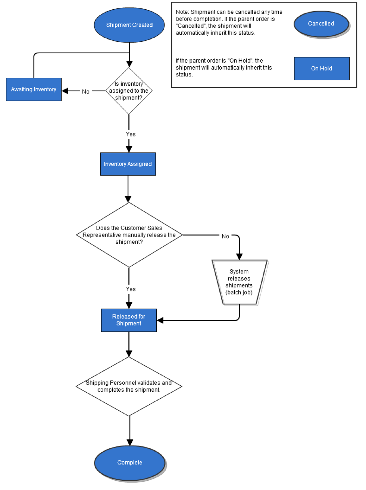

# Appendix A: Workflow Diagrams

[TOC]

## Order Workflow Process

| **Order Workflow State** | **Notes** |
| --- | --- |
| ORDER CREATED | The order was successfully submitted and will be processed. |
| FAILED | The submitted order was not properly captured and, therefore, could not be processed.|
| ON HOLD | An order can be placed On Hold at any time except if the order is already in a Complete or Partially Shipped state. When released, the order returns to its previous state. |
| CANCELLED | An order can be cancelled at any time except if the order is already in a Complete or Partially Shipped state. |
| IN PROGRESS | The order is in the process of being fulfilled. |
| AWAITING EXCHANGE | The order is part of an exchange. It cannot progress until an item from the originating order is received. After receipt, the order will automatically proceed to the In Progress state. |
| PARTIALLY SHIPPED | The order may contain multiple shipments, with each shipment being processed separately. |
| COMPLETE | The order is complete. Any further processing of the items in the order would need to be managed by initiating a return or an exchange. |

## Shipment Workflow Process

## Returns and Exchanges Workflow Process

