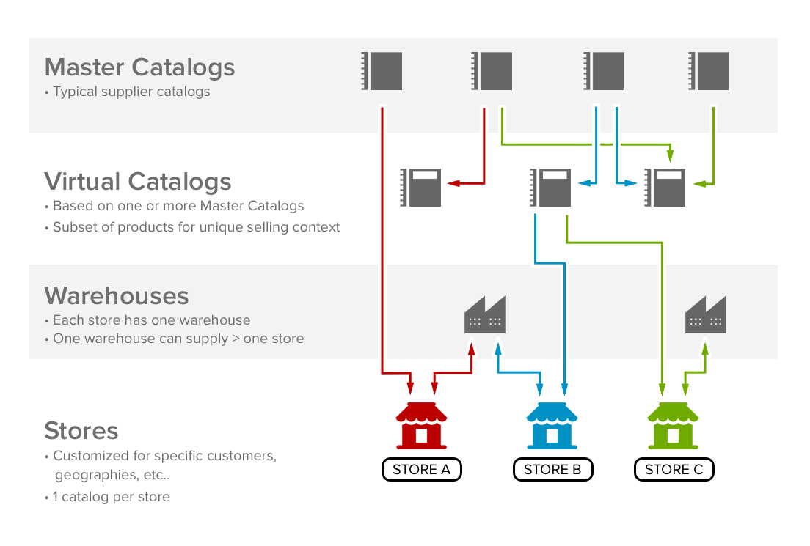
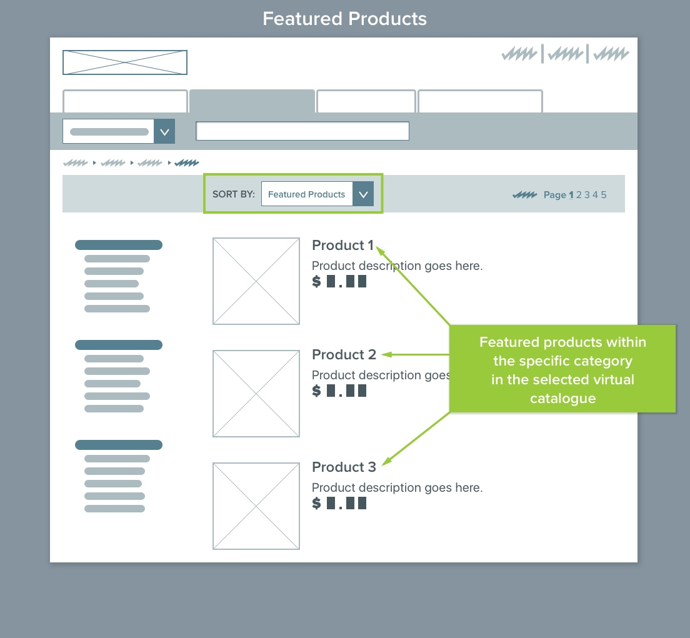
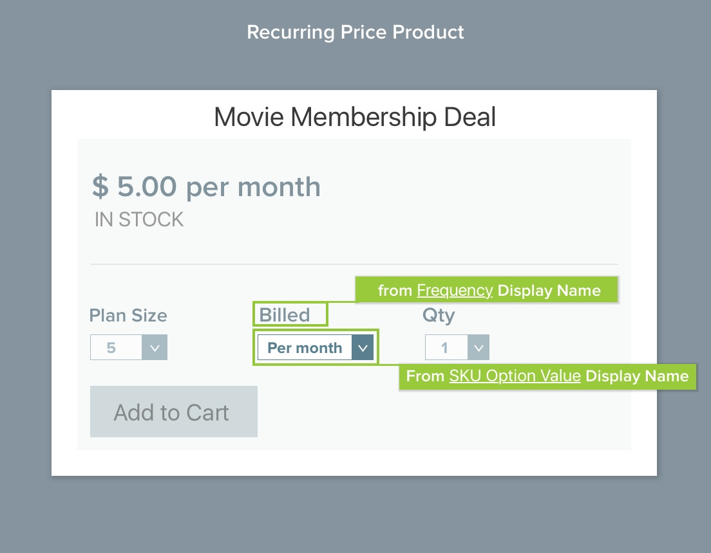
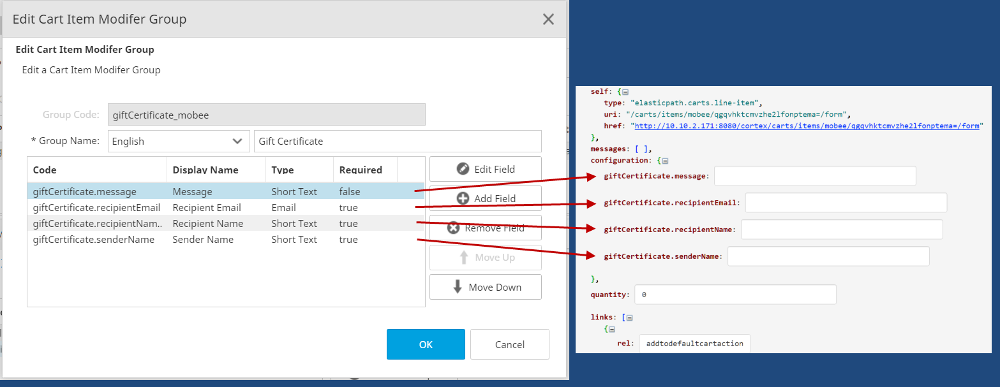
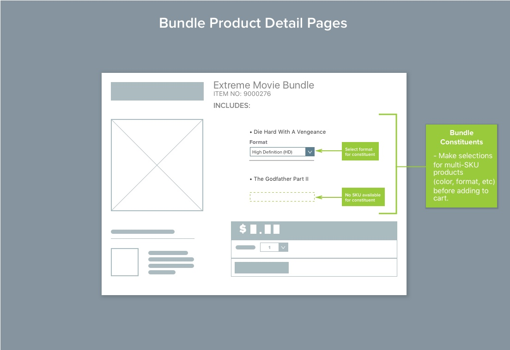
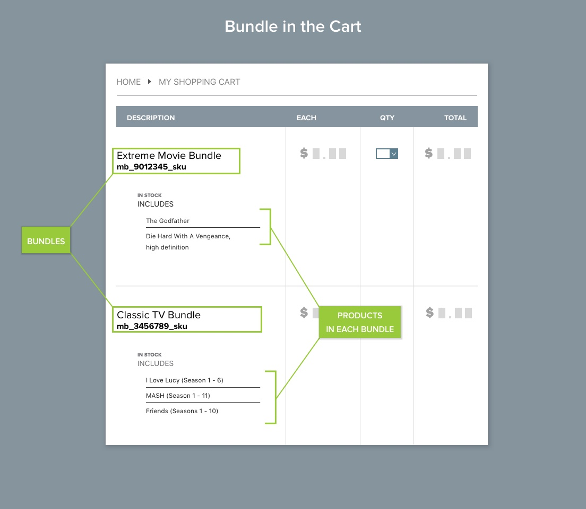
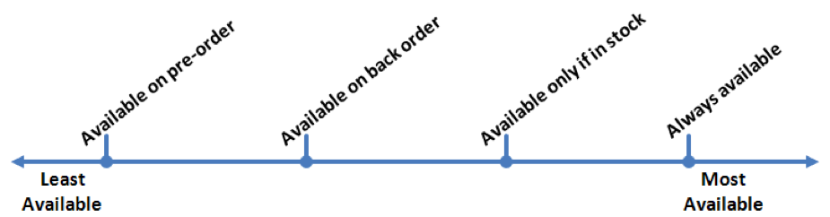

# Chapter 5: Catalog Management

[TOC]

## Overview

The Catalog Management activity provides users with the ability to import, create, and manage catalogs, product categories, and products. You can access it from the toolbar.

## Catalogs and Virtual Catalogs

Catalogs are collections of products. They are independent from one another, and you may have as many catalogs as required.

Virtual catalogs are conceptual creations that make the management of store catalogs easier. The products in a virtual catalog are inherited from regular catalogs. Virtual catalogs may be constructed from any combination of catalogs and catalog products.

For example, a clothing retailer may build a virtual catalog for the Fall shopping season that consists of specific products from a number of different regular catalogs (for example, warm jackets from Coats and gloves from Accessories).

## Catalogs

Each catalog has a unique name and is independent from the other catalogs. Besides choosing a name, the store administrator must also decide the languages the new catalog supports.

Catalogs should be used in the following situations:

- A manufacturer may operate a number of different brands or product lines. Each brand or product line should have its own catalog of all the offerings for that category.
- A retailer may have a number of different suppliers. Each supplier has their own catalog, populated with the goods they offer.

> **Note**: If you have recurring charge products in your Elastic Path deployment you may only have them in one (master) catalog.

### Importing Catalogs

Before you can import the catalog data, you must create a catalog import job. The import job describes the column structure of the import data files and how the columns are mapped to the data fields.

> **Tip:** For online tutorials on this topic, see http://developers.elasticpath.com.

#### Creating a Catalog Import Job

1. Create a CSV template file that describes the structure of the data you want to import. This file must contain a line of comma-separated values, and each value should be the column name or a description of the column data. For example, the CSV files that you need to import can be  structured as follows:

    &lt;category code&gt;,&lt;parent category code&gt;,&lt;display name&gt;

    The line should look similar to the following:

    Category Code,Parent Category Code,Display Name

2. On the toolbar, click the **Catalog Management** button.

3. On the toolbar, click the **View Catalog Import Jobs**  button. The **Import Jobs** tab appears in the top right pane.

4. On the top right pane toolbar, click **Create Import Job**. The _Create Import Job_ wizard appears.

5. Configure the following settings:

    | **Field** | **Description** |
    | --- | --- |
    | Catalog | The catalog in which the data will be imported into. |
    | Data Type | The type of data you are importing. The data type depends on the selected catalog, the type of object (category, product, product SKU, product association), and the Product Type (for products). |
    | Import Type | **Insert &amp; Replace**: Inserts the objects from the data file. If there is a conflict between an existing object and an object being imported, the existing object is overwritten with the object being imported. **Update**: Only updates the  existing objects based on the data in the data file. The new objects are not imported. **Insert**: Inserts the data from the data file. If there is a conflict between an existing object and an object being imported, the existing object remains unchanged and the object in the data file is ignored. **Delete**: Deletes the objects specified in the data file. |
    | Import Name | The name of the list of catalog import jobs. |
    | CSV Import File | The file path of the CSV template file created in Step 1. |
    | Column Delimiter | The character that separates each value in a line. All the text values must begin and end with the text delimiter character. |
    | Text Delimiter | The character that surrounds text values in a line. |
    | Max errors during import (default) | The number of non-fatal errors that can occur before an import of this type is terminated. If the import is aborted, it does not rollback the import that is already completed to that point. |

6. Click **Next**. Elastic Path Commerce verifies that the CSV file contains valid data and reports any errors. If there are any errors, correct them, and click **Back** to repeat this step.

7. In the _Map Data Fields_ screen of the wizard, specify how the data in the CSV file is mapped to fields in the database. For each data field to map, select the field in the **Data Fields** list. Then, select the appropriate column in the **CSV Columns** list and click **Map**.

    > **Note:** It is not necessary to map all the data fields to all the CSV columns. Map only the fields that are marked by an asterisk (\*) in the **Data Fields** list.

8. Click **Finish**.

#### Performing a Catalog Import Job

1. On the toolbar, click the **Catalog Management** button.

2. On the toolbar, click the **View Catalog Import Jobs**  button. The **Import Jobs** tab appears in the top right pane.

3. Select the job you want to run.

4. Click **Run Import Job**.

5. Click the browse button next to the **CSV Import File** field, and locate the CSV file that contains the inventory data you want to import.

6. Click **Next**. Elastic Path Commerce verifies that the CSV file contains valid data and reports any errors. If there are any errors, correct them, and click **Back** to repeat this step.

7. Click **Finish**. The import may take a few minutes, depending on the amount of data in the file.

### Creating a Catalog

1. On the toolbar, click the **Create Catalog**  button. The _Create Catalog_ dialog box appears.

2. Enter information in the following fields:

    | **Field** | **Description** |
    | --- | --- |
    | Catalog Code | The unique identifier for the catalog. You cannot change the code after the catalog is created. |
    | Catalog Name | The name of the catalog being created. |
    | Selected Languages | The languages supported by the catalog. You must add at least one language to this list. |
    | Default Language | The default display language for the product and category information. This list is populated from languages in the **Selected Languages** list. |

    > **Note:** After the catalog is created, you can add languages to the **Selected Languages** list. However, after a language is added, you cannot remove it.

### Editing a Catalog

1. On the toolbar, click the **Catalog Management** button.

2. In the left pane, double-click the catalog you want to edit and open it. Alternatively, right-click the catalog, and select **Open** from the submenu. The catalog opens with the **Summary** tab displayed in the right pane.

3. Click the different tabs at the bottom of the pane to view and modify the attributes in each of them.

#### Summary Tab

Use this tab to set the catalog information and the languages to display the catalog text in.

| **Field** | **Description** |
| --- | --- |
| Catalog Code | A unique identifier for the catalog. You cannot change the code after the catalog is created. |
| Catalog Name | The name of the catalog. |
| Default Language | The default display language for the  product and category information. |
| Available/Selected Languages | The languages supported by the catalog. At least one language must be listed in the **Selected Languages** list. |

#### Attributes Tab

Use this tab to add, change, and delete attributes for the selected catalog. **Note**: If you want to set the attributes that apply to all the catalogs, you must create global attributes using the **Catalog Management &gt; Edit Global Attributes** function.)

Catalog attributes are descriptive aspects of a product or category in a catalog. For example, if your storefront sells luggage, you could add an attribute called _Material_. The possible values for this attribute include vinyl, leather, and canvas.

> **Note**: Adding an attribute allows you to set the values for that attribute in the catalog from within Elastic Path Commerce. But, the attribute is not visible in the frontend unless it is used by the CMS template that controls the frontend . For more information, see the _Elastic Path Commerce Developer Guide_.

To add an attribute, click **Add Attribute**. The _Add Attribute_ dialog box appears. Enter values as described in the following table.

| **Field** | **Description** |
| --- | --- |
| Attribute Key | The _Attribute Key_ should follow the Attribute Key naming convention used by your organization. For example, a six character alpha-numeric string beginning with an &quot;A&quot;.   |
| Attribute Name | The _Attribute Name_ is a short text entry. |
| Attribute Usage | The _Attribute Usage_ specifies the item in the catalog hierarchy the attribute is associated to. For example, the &quot;Material&quot; attribute would apply to _Products_, but not to _SKUs_. The possible usage types are: Category, Product, SKU, and Customer Profile |
| Attribute Type | The _Attribute Type_ tells the system the types of characters that are valid for the attribute.  For example, a string or integer). |
| Multi-Language | Specifies whether you can enter multi-language text for the attribute when setting up a product. For example, in a store configured for English and French, you would be able to enter text descriptions for a product in both languages. |
| Required Attribute | Specifies whether a value must be entered for this attribute when a user is setting up a product. |
| Multiple Values Allowed | Specifies whether a long or short text attribute can accept multiple values shown in a list. For example, an attribute describing a 35 mm camera film speed would be easier to use if the film speed values were presented in a list. |

#### Cart Item Modifier Groups Tab

Use this tab to add, change, and delete groupings of fields used when collecting data from your customer for a given product when adding it to the cart. That is, these fields are associated to the products making them &#39;configurable&#39; by the customer when purchasing.

Configurable products are useful when you need to collect information from the customer regarding the specific product to be able to complete the purchase.  For example, when purchasing a personalized t-shirt, the customer must provide the name they want to be imprinted on the shirt, or when purchasing a gift certificate, the customer must provide the name and email address to send the gift certificate code to, or when purchasing carpet cleaning services, the customer must provide the date and address they are requesting the service on.

You are not required to create the cart item modifier groups; however, if you have products that require input from the customer before purchase, these groupings allow you to create different groupings of product metadata to collect from the customer.

To add a cart item modifier group, click **Add Group**. The _Add Cart Item Modifier Group_ dialog box appears. Enter the values as described in the following table.

| **Field** | **Description** |
| --- | --- |
| Group Code | The _Group Code_ should follow the naming convention used by your organization. |
| Group Name | The _Group Name_ is the assigned name or the working name for this grouping of fields. **Note**: You can provide the value of this field in one of the languages supported by the catalog, so that this value is displayed to the customer.|

You are able to add as many fields as required to a group, and the fields may be of various types.

To add a field to the group, click **Add Field**. The _Add Cart Item Modifier Group Field_ dialog box appears. Enter the values as described in the following table.

| **Field** | **Description** |
| --- | --- |
| Code | The _Code_ should follow the naming convention used by your organization for configurable fields. |
| Display Name | The _Display Name_ is the name displayed to the customer. |
| Field Type | Select the type of value to provide. Selection of a given type may provide additional configuration fields. For example, selecting **short-text** requires a maximum field size value to be configured. |
| Required | Indicates whether the field requires a value before it is to the cart. |

You cannot share the cart item modifier groups between the master catalogs. If you have the same groupings in multiple maser catalogs, you need to create each independently.

Similarly, you cannot share the cart item modifier fields between groups.  If you have the same field to use in multiple groups, you need to add the field independently to each group.

#### Category Types Tab

A category type defines the set of attributes for a category. Use this tab to add, modify, and delete category types in a catalog.

In a relatively simple catalog, you may only need one category type; whereas, more complex catalogs may require several category types. For example, if your business offers electronics and kitchen supplies, you may want to have two category types: electronics attributes and kitchen-related category attributes.

To add a category type, click **Add Category Type**. The _Add Category Type_ dialog box appears. Enter the values as described in the following table.

| **Field** | **Description** |
| --- | --- |
| Name | The name for the category type. |
| Category Description | The description of the category type.
| Category Image | Indicates that a category type has an image associated to it. |
| Available Attributes and Assigned Attributes | Assigned attributes become available on the **Attributes** tab for a selected category when a user creates or edits a category of that category type. Click **&gt;** to add the  available attributes to this category type. |

#### Product Types Tab

A product type defines the set of attributes for a product and the template used to display that product in the frontend. Use the **Product Types** tab to add, modify, and delete the product types in a catalog.

After you have created a product type, you can associate it to the necessary product attributes that describe that type of product.

To add a product type, click **Add Product Type**. The _Add Product Type_ dialog box appears. Enter the values as described in the following table.

| **Field** | **Description** |
| --- | --- |
| Name | The name of the product type. |
| Default Tax Code | The applicable tax code for this product type. Tax Codes are added to Elastic Path Commerce by your store administrator using the _Configuration_ activity.   |
| Available Attributes and Assigned Attributes | The list of available system attributes are listed on the left. The attributes in the **Assigned Attributes** list appear as fields to complete when creating or modifying a product of this product type.    Click **&gt;** to add the available attributes to this product type. |
| Available and Assigned Cart Item Modifier Groups | The list of available cart item modifier groups is on the left. The groups in the **Assigned Cart Item Modifier Groups** list appear as fields to complete when adding the product of this product type to the cart.    Click **&gt;** to add the available cart item modifier groups to this product type. |
| Product type has multiple SKUs | Specifies whether the product type requires SKU options or is a recurring charge product. SKU options allow multiple attribute values for a product, so that the shopper can select a combination of those attributes for a single product.   The attribute combinations for the product are recorded as separate SKUs. For a recurring charge product type, you must select **Frequency** as one of the SKU options. For more information, see _SKU Options Tab_.|
| Product type is discountable | Specifies whether the product type can be discounted. |

#### SKU Options Tab

Use this tab to add, edit, and remove SKU options for multi-SKU and recurring charge products. For example, if your store sells a camera bag with product code &quot;123&quot; that comes in large, medium, and small sizes, and in blue, black, and green color, you would set up the size and color attributes on this tab, so that the product size and color combinations can be accessible from the bag&#39;s product SKU.

To add a SKU option, click **Add SKU Option**. The _Add SKU Option_ dialog box appears. Enter the values as described in the following table.

| **Field** | **Description** |
| --- | --- |
| SKU Option/Value | The options for the multi-SKU products in the category, and the values that can be selected for each option.   If the catalog contains gift certificates, you must add the following two SKU options: **GC\_Theme**, **GC\_Denomination**. The image of **GC\_Theme** specifies a design theme that customers can choose when purchasing a gift certificate. **GC\_Denomination** specifies a gift certificate amount that customers can choose when purchasing a gift certificate.   If the catalog contains recurring charge products, you must add the following SKU option: **Frequency**. Enter **Frequency** in the **Code** field and the billing frequency term in the **Display Name** field. For example, &quot;Billing Cycle&quot;. The payment frequencies would be SKU options under Frequency. For example, an option with SEC for the code and per second for the display name would have per second billing frequency. A one-time charge SKU option must have the code NA. |
| Display Name | The name of the option that appears to shoppers in the frontend. |
| Image | The image associated to the SKU option. |
| Code | The shortened version of the option and value. For example, the code for the option Bag Size with a value of Medium could be &quot;BSM&quot;. **Note**: You cannot modify this field in the _Edit SKU Option Value_ dialog box. |

The buttons on this tab allow you to manage the attributes and attribute values.

#### Brands Tab

Use this tab to add, edit, and remove brands from a catalog.

To add a brand to the catalog, click **Add Brand**. The _Add Brand_ dialog box appears. Enter the values as described in the following table.

| **Field** | **Description** |
| --- | --- |
| Brand Code | The identifier for this brand. |
| Brand Name | The name of the brand.   |

### Deleting a Catalog

To delete a catalog, right-click it, and select **Delete** from the submenu.

> **Note:** You can delete a catalog only if it does not contain any categories or products.

## Virtual Catalogs

A virtual catalog must have a unique name that differentiates it from other virtual catalogs and regular (master) catalogs. Virtual catalogs are built with products and categories from master catalogs. However, you cannot add products from one virtual catalog to another.

A virtual catalog may have unique categories that are not found in the master catalog it is inheriting its products from. This allows more flexibility in structuring a virtual catalog&#39;s categorical hierarchy. However, the products in a virtual category must already exist in a master catalog. Virtual catalogs can inherit any subset of a master catalog.

> **Note**: Virtual catalogs provide you only with a _view_ of the products from the master catalogs. You cannot modify the actual product data (other than its price) in a virtual catalog. Instead, you must modify the product&#39;s details from its master catalog. This also means that if a change is made to a product in a master catalog, any virtual catalogs that inherited that product are also changed.

> **Note**: This does _not_ include _Merchandising Associations_ or _Category Assignments_, as those attributes are independent from the master catalog and are not inherited from it.

Whether a virtual catalog is required or not depends on the requirements of your stores. Typically, virtual catalogs may be required in the following cases:

- To support secondary or tertiary stores that sell a subset of the main store&#39;s catalog. For example, a company may operate a general-purpose electronics store, [www.electronics.com](http://www.electronics.com), and as two niche stores, [www.digitalcameras.com](http://www.digitalcameras.com) and [www.camcorders.com](http://www.camcorders.com). The two niche stores only sell a subset of the products sold in [www.electronics.com](http://www.electronics.com), and may have different pricing structures. In this case, a master catalog supports the main store, and the two virtual catalogs support each of the niche stores.

- To support geographical stores where individual operating countries may sell a subset of the product range and pricing may differ between countries, a master catalog would reflect the company&#39;s worldwide catalog, and a virtual catalog would be used for each geographical store. If geographical stores are similar (for example, two countries in the European Union), they may both use the same virtual catalog.

- To allow suppliers to manage their own catalogs, each supplier can have their own master catalog. As the store operator you can have a single virtual catalog that consumes the categories and products you want to sell in your store from each of the supplier master catalogs.

### Creating a Virtual Catalog

1. On the toolbar, click the **Catalog Management** button. The Catalog Browse tab appears in the left pane.

2. On the toolbar, click the **Create Virtual Catalog**  button. The _Create Virtual Catalog_ dialog box appears.

3. Enter the **Catalog Code** and **Catalog Name** for the virtual catalog.

4. From the **Default Language** list, select the default language to use for the virtual catalog.

5. Click **Save**.  

### Editing a Virtual Catalog

You can edit the display name of a virtual catalog by right-clicking it, and selecting **Open** from the submenu. The _Edit Virtual Catalog_ dialog box appears in which you can change the display name of the virtual catalog.

### Including or Excluding a Product from a Virtual Catalog

1. On the toolbar, click the **Catalog Management** button. The Catalog Browse tab appears in the left pane.

2. In the left pane, select the virtual catalog that contains the product you want to include or exclude.

3. Select the product that you want to include or exclude.

4. On the top right pane toolbar, click **Include Product** or **Exclude Product**.

    > **Note:** Only one of the two buttons - **Include Product** or **Exclude Product** is active for a given product. You can include a product in the virtual catalog only if it is not already a part of that same virtual catalog. While you can exclude a product from a virtual catalog only when the product is included in a virtual catalog.

### Deleting a Virtual Catalog

You can delete a virtual catalog by right-clicking it, and selecting **Delete** from the submenu.

## Global Attributes

A global attribute can be shared across multiple catalogs. This enables administrators to not have to recreate the same attribute for every new catalog.

### Creating a Global Attribute

1. On the toolbar, click the **Edit Global Attributes**  button. The _Edit Global Attributes_ dialog box appears.

2. Click **Add Attribute**. The _Add Attribute_ dialog box appears.

3. Set the attributes and values for your new global attribute.

4. Click **Add** when you are done.

5. In the _Edit Global Attributes_ dialog box, click **Save**.

### Editing a Global Attribute

1. On the toolbar, click the **Edit Global Attributes** button. The _Edit Global Attributes_ dialog box appears.

2. Select the global attribute that you want to edit.

3. Click **Edit Attribute**. The _Edit Attribute_ dialog box appears.

4. Make your changes and click **OK**.

5. In the _Edit Global Attributes_ dialog box, click **Save**.

### Deleting a Global Attribute

1. On the toolbar, click the **Edit Global Attributes** button. The _Edit Global Attributes_ dialog box appears.

2. Select the global attribute that you want to delete.

3. Click **Remove Attribute.** A message appears asking you to confirm the deletion.

4. Click **OK**.

5. In the _Edit Global Attributes_ dialog box, click the **Save** button.

## Categories

Categories are used to organize the contents of catalogs. They can contain products and other categories.

> **Note:** New categories appear in the store immediately. Only top level categories do not appear until the server is restarted.

### Importing Categories and Products

Store administrators usually import product and category data using the Import Manager tool. The data is imported from comma-separated value (CSV) files. This is an alternative to manually creating them, especially for large amounts of catalog data.

> **Note:** The CSV files may use characters other than commas to separate values. You can create the CSV files from an Excel spreadsheet or a text editor.

> **Note:** A new record (customer, order, category, product, or SKU) does not appear immediately in the search results. This occurs because new records are indexed only at scheduled intervals. The intervals are configured during the initial store setup by the administrator, and can be re-indexed manually using the **System Configuration** activity.

### Browsing Categories and Products

1. On the toolbar, click the **Catalog Management** button. The **Catalog Browse** tab appears in the left pane with the catalogs, categories, and products arranged in a hierarchical tree-like structure. You can expand and collapse the items in the hierarchy.

2. To view the products contained in a category, double-click the category. The products are displayed in the **Product Listing** tab on the top right pane.

### Creating a Category

1. On the toolbar, click the **Catalog Management** button. The **Catalog Browse** tab appears in the left pane.

2. Select the catalog in which you want to create the category, and click the **Create Category**  button.

    Alternatively, right-click the catalog in which you want to create the category, and select **Create Category** from the submenu.

    > **Note:** If the **Create Category** button is unavailable, your Elastic Path Commerce system may be using the Change Set feature. You must select a Change Set before creating a category.

    The _Create Category_ dialog box appears.

3. Enter values in the following fields:

    | Field | Value |
    | --- | --- |
    | Category Code | The unique identifier for the category. |
    | Category Name | The category name that appears in the store. |
    | Category Type | The attributes associated with the category. |
    | Enable Date/Time | Specifies when the category becomes Store Visible. This is useful for seasonal catalogs. |
    | Disable Date/Time | Specifies when the category no longer appears in the store. |
    | Store Visible| Specifies whether the category appears in the store. We recommend that a newly created category does not appear until the products are added to it. |

4. Click **Finish**.

### Creating a Sub-Category

1. On the toolbar, click the **Catalog Management** button. The **Catalog Browse** tab appears in the left pane.

2. Select the category in which you want to create the subcategory, and click the **Create Sub-Category**  button. The _Create Category_ dialog box appears.

3. Enter the values in the required fields.

4. Click **Finish**.

### Adding a Linked Category

A linked category is a category in a virtual catalog that is inherited from a master catalog. The inherited category contains links to all of the products from the source category in the master catalog. All of the product attributes are inherited with each product, except for the Merchandising Associations and Category Assignments.

1. On the toolbar, click the **Catalog Management** button. The **Catalog Browse** tab appears in the left pane.

2. In the **Catalog Browse** tab, select the virtual catalog in which you want to add the linked category.

3. Click the **Add Linked Category**  button.  

    Alternatively, right-click the virtual catalog in which you want to create the linked category, and select **Add Linked Category** from the submenu.

    The _Select a Category_ dialog box appears.

4. Enter search terms into the **Category Name** and **Category Code** fields and click **Search**. The categories are listed in the left pane.

5. Click the category you wish to link to, and then click **OK**.

    The category in the master catalog is added as a link to the virtual catalog.

### Organizing Categories

To change the order of a category, right-click the category, and select **Move Category Up** or **Move Category Down** from the submenu.

### Deleting a Category

> **Note:** You can delete categories only if they do not contain products or sub-categories.

1. On the toolbar, click the **Catalog Management** button. The **Catalog Browse** tab appears in the left pane.

2. Select the category you want to delete.

3. Right-click it and select **Delete** from the submenu.

4. Click **OK**.

## Featured Products

_Featured products_ appear in the frontend when shoppers view product pages by category.

 <!--DIAGRAM-->

Featured products are controlled at the _Category_ level in Elastic Path Commerce.

> **Note:** The Data Sync Tool does not sync featured product information.

### Adding Featured Products

1. On the toolbar, click the **Catalog Management** button. The **Catalog Browse** tab appears in the left pane.

2. Expand the catalog to show the category containing the product you want to feature.

3. Right-click the category and select **Open** from the submenu.

4. In the bottom right pane, click the **Featured Products** tab.

5. Click **Add**. The _Select product from category_ dialog box appears.

6. Use the **Search** fields to find the product you want to feature for this category.

7. Click **OK**.

### Changing the Featured Product Display Order

To change the order in which the featured products display in your store, use the **Move Up** and **Move Down** buttons in the **Featured Products** tab.

### Removing Featured Products

1. On the toolbar, click the **Catalog Management** button. The **Catalog Browse** tab appears in the left pane.

2. Expand the catalog to show the category containing the featured product you want to remove.

3. Right-click the category and click **Open**.

4. In the bottom right pane, click the **Featured Products** tab.

5. Click the product you want to remove as a featured product.

6. Click **Remove**. A confirmation message appears.

7. Click **OK**. The product is removed from the Featured Products list.

## Products

A _product_ in Elastic Path Commerce corresponds to a real-life product. Every product has characteristics and can be sold.

Every product is assigned to a _product type_. A product type defines how a particular set of products is displayed, the tax codes that apply to it, and the attributes and SKU options that are available for products of that type.

### Single and Multi-SKU Products

Every product in an Elastic Path Commerce catalog has at least one SKU (Stock Keeping Unit number). An SKU identifies a specific version of a product. A product can have multiple SKUs, with each SKU corresponding to a particular offering of the product.

For example, a portable MP3 audio player product is configured with multiple SKUs representing different combinations of color and storage capacity.

The product type assigned to a product defines whether the product has one or more SKUs. If you are setting up a multi-SKU product, you must assign it to a product type that allows multiple SKUs.

Multiple SKU products are identified with a colored icon in the **Product Listings** tab, while single SKU products do not have a colored icon.

When you open a multiple SKU product, you can view the parent SKU and the child SKUs beneath it on the **SKU Details** tab. The child SKU is identified by a barcode on the tab.

For more information on setting up products, see _Creating a Product_.

### Browsing for and Viewing Products

You view products by performing a catalog search, or by browsing the catalog and double-clicking a category to display a list of all the products contained within it. The **Product Listing** tab displays the products.

To display the details for a listed product, double-click it. The **Summary** tab appears.

### Searching for Products

1. On the toolbar, click the **Catalog Management** button. The **Catalog Browse** tab appears in the left pane.

2. In the left pane, click the **Search** tab.

3. In the **Products &amp; Bundles** tab, enter a **Product Name**, **Product Code**, or **SKU Code** in the **Search Term** section. You must enter a value in at least one of these fields.

4. In the **Filters** section, select a brand and catalog to search within.

5. In the **Sorting** section, choose the column to sort the search results, and choose whether to sort in an  ascending or descending order.
You can also sort the results of your search by clicking a column header in the results list.

6. Click **Search**. The **Product Search Results** tab appears in the top right pane displaying the products matching the search criteria.

7. To view detailed information about a product, double-click the product from the search results list. The
product information is represented in the following tabs on the bottom right pane.

#### Summary Tab

The **Summary** tab contains the following information:

| **Field** | **Description** |
| --- | --- |
| Product Code | A unique, internal identifier for a product. It is not displayed to the customers. |
| Product Name | The name of the product. This is displayed in the store to the customers. |
| Product Type | Specifies how the product is displayed and taxed, and the attributes and SKU options that are available to it. |
| Tax Code | Specifies the tax codes that apply to the product. |
| Brand | The product&#39;s brand. |
| Not Sold Separately | Specifies whether the product can only be added to a shopping cart as a bundle item. Such a product can still be visible in the store, but cannot be added to a cart individually. |
| Store Visible | Specifies whether shoppers can view the product in the store. **Note**: A product&#39;s visibility is superseded by the settings of its parent category. For example, if a digital camera is visible, but the camera category is not visible in the store, then the digital camera is also not visible in the store. |
| Enable Date/Time | Specifies when the product will be visible in the store (assuming the **Store Visible** attribute is activated.) |
| Disable Date/Time | Specifies when the product will no longer be visible in the store. |
| Minimum Order Quantity | Specifies how many items of the product a customer must order before the transaction is allowed. |
| Availability Rule | Specifies whether the product appears in the store when it is currently not in stock. Customers can pre-order a product if the item is not yet available for sale, that is, they commit to buying the product when it becomes available. Back orders are used when customers wish to buy out-of-stock products. The buyers can reserve the product and commit to purchasing the item once new shipments arrive. Products can be created with the following availability rules:   - Available only if in stock (default)   - Available on pre order   - Available on back order   - Always Available – Assumes this is a digital product, like a software or a game, where tracking the product&#39;s inventory is not applicable.   If **Available on pre order** is selected, the following field is required:   - Expected Availability Date (the date that the item is expected to be available) |

#### Pricing Tab

Use this tab to view and edit the price list information for a product. The tab shows all the entries for the product in the selected price list.

The **Pricing** tab contains the following information:

| **Field/Column/Button** | **Description** |
| --- | --- |
| Price List | The price list that the currently displayed pricing information is derived from. |
| Product Code | A unique, internal identifier for a product. It is not displayed to customers. |
| SKU Code | The SKU (Stock Keeping Unit) code represents the exact variant of an item being sold in the store. It is linked to available inventory. |
| SKU Configuration | The names of the different SKU options, if applicable. For example, the different color variants of a product. |
| Quantity | The minimum quantity a customer is required to order before the given price tier applies. This value implies a range. For example, if the price tiers are defined for the two quantities &quot;1&quot; and &quot;3&quot;, the first tier would apply to quantities from 1 to 2, while the second tier would apply to quantities of 3 or more. |
| List Price | The regular price of a product or SKU. |
| Sale Price | The sale price of a product or SKU. |
| Payment Schedule | The payment frequency (for example, _per month_) of a recurring charge. For non-recurring charge items, either a blank or **NA** would be displayed in this column. |
| Add Tier | Create a price tier that applies different prices to the different quantities being purchased. For example, volume purchasing discounts. |
| Edit Tier | Edit an existing price tier. |
| Remove Tier | Delete an existing price tier. |
| Open Item | Opens a tab for the selected item. |

You can define price tiers for a product. Tiered pricing allows you to establish volume discounts for a product. This is particularly useful in promoting larger volume purchases. For example, in a wholesale or e-procurement/B2B situation. You can define multiple price tiers for a product as long as the item ranges do not conflict with one another.

For example, a clothing retailer may offer T-shirts at different prices depending on the quantity being purchased. The following price tiers could be established:
 - 1-5 T-shirts at $20 each
 - 6-10 T-shirts at $17 each
 - 11 or more T-shirts at $15 each.

This encourages customers to buy more products to get the lower unit pricing.

#### Image Tab

The **Image** tab lets you specify the default image for the product. Specifying an image for a product is optional.

The image gets uploaded using the Asset Manager tool. For more information, see the _Assets_ section.

The selected image is displayed on both the product&#39;s details page and as its thumbnail image in search results. The system automatically adjusts the dimensions of the submitted images for display within the store.

You can specify additional images using the **Attributes** tab, depending on the template layout.

#### Attributes Tab

The **Attributes** tab lets you assign values to the attributes of the product. An attribute is any descriptive feature of the product that factors into a customer&#39;s purchase decision.

Attributes that are specific to the Product Type that the product belongs to are displayed here.

#### SKU Details Tab

Product SKUs are used to identify specific versions of a product. Every product can have multiple SKUs, with each SKU corresponding to a particular offering of the product.

For example, a portable mp3 audio player product could be configured using multiple SKUs, representing the different combinations of color and storage capacity.

Whether a product can have single or multiple SKUs is determined by its associated Product Type. You cannot change a product from a single SKU product to a multi-SKU product. Instead, you must create a new product with the same information as the single SKU product, and assign it to a multi-SKU Product Type.

The **SKU Details** tab contains the following information:

| **Field** | **Description** |
| --- | --- |
| SKU Code | A unique identifier for a product that is visible to the store and other external systems. |
| Shippable | Specifies whether the product is physically shippable or not. This should be enabled for all products (except digital goods and recurring charge products). The information specified below can be used by the integrated shipping systems (for example, UPS) to calculate the real-time shipping rates. |
| Shipping and Inventory Details | The following fields appear in this section: Shipping Weight (kg), Shipping Width (cm), Shipping Length (cm), Shipping Height (cm)|

##### Inventory Tracking Details

Specifies whether the system should track this product&#39;s inventory or not. This is activated unless the product has &quot;infinite stock&quot; (for example, digital goods).

| **Field** | **Description** |
| --- | --- |
| On Hand | The total quantity of inventory in a warehouse. This is synchronized with the company&#39;s warehouse or ERP system so the quantity stays up to date. |
| Available | The quantity available in a warehouse that can be purchased. For example, if On Hand is 100 and Reserved is 10, Available would be 90. |
| Allocated | The quantity allocated to fulfill current (pending) orders. |
| Reserved | The quantity of goods unavailable for sale in the store. |
| Re-Order Minimum | Specifies when an item should be included in the Low Stock report, that is, when the _On Hand_ is less than the _Re-order Quantity_.) |
| Re-Order Quantity | This field is intended as a visual reminder to the warehouse person to order this amount of stock when the _On Hand_ gets low. |
| Expected Re-Order Date | The date when stock is expected to come in. |

##### Digital Asset Details

Digital goods are products in a digital format. For example, e-books, digital photos, MP3 files, PDF reports, and software downloads all constitute digital assets. These types of goods are assumed to have unlimited inventory.

Products that are defined as digital goods can be optionally downloaded. The security is automatically set to prevent unauthorized users from retrieving the content.

| **Field** | **Description** |
| --- | --- |
| File | The file (digital asset) the product represents. |
| Download Limit | The maximum number of times a customer can download the asset. |
| Download Expiry | The time frame when the customer is allowed to download the asset. It is defined in terms of the number of days after the order is placed. |

#### Category Assignment Tab

Categories are groupings of products that are used when filtering products in the fronted. You can assign different categories for each master and virtual catalog.

Select a **Primary Category** for the product. You can add secondary categories by clicking **Add Category** and selecting another category.

While a product may belong to more than one category, it must have a &quot;default&quot; primary category.

#### Merchandising Associations Tab

Merchandising refers to the practice of displaying related items on the product pages. The store&#39;s administrators must define what a &quot;related&quot; product means and specify the nature of the association here. See the _Merchandising Associations_ section for more information.

Merchandising associations are extremely effective at increasing the average order size for e-commerce sites. They allow store administrators to promote related products on the same page that the customer is currently viewing. The goal is to increase the size of the customer&#39;s shopping cart, or to encourage the purchase of a higher profit item.

Use this tab to add the following types of associations to the other products:

- **Cross Sells**: Promote alternative purchasing options that are similar to the product that the customer is currently viewing. Store merchandisers often use this feature to increase the sales of higher profit or overstocked items. For example, a customer viewing a Canon camera could be recommended an overstocked Sony camera by using the cross selling feature.

- **Up Sells**: Promote more expensive versions of the currently viewed product. It encourages customers to purchase more higher-end models, which could be from any manufacturer. For example, a customer who is looking at the iPod Nano product page could be recommended the iPod Classic and iPod Touch - products that are more expensive than the iPod Nano. However, the iPod Shuffle should not be included in these recommendations, as it is a cheaper product.

- **Warranties**: Promote &quot;add-on&quot; products (for example, extended service plans.)  As warranty products are usually sold with a product, recommendations on the product page are the most sensible way to sell this type of product.

- **Accessories**: Promote complementary goods to the currently viewed product. This method encourages buyers to purchase more items and increases the average transaction per order. For example, a customer who adds a camera to their cart can be encouraged to purchase a 1 GB memory card, a carrying case, and a second set of batteries.

- **Replacements**: Recommend the substitute goods when a product is discontinued or is out of stock. This increases your store&#39;s conversion rate, as a customer who may have purchased nothing instead purchases a similar product. For instance, the iPod mini was replaced by the iPod. Although the store no longer has iPod minis, leave the product page visible to prevent dead links and to maximize the value of a high search engine ranking. When customers looking for an iPod mini come to the store, they see that it is discontinued; however, they wnotice the iPod being recommended to them, which may create a successful conversion.

The **Merchandising Associations** tab displays sub-tabs for the master and virtual catalogs in your system. The associations can be configured differently for each catalog.

Each merchandising association has the following attributes:

| **Field** | **Description** |
| --- | --- |
| Product Code | The code for the product to be recommended: cross sell, up sell, warranty, accessories, and replacement. |
| Merchandising Type | The type of merchandising association to be created. |
| Default Quantity | The quantity of the product to be recommended. For example, if a camera requires four AA batteries, then the _Default Quantity_ of the associated product (batteries) should be set to 4. **Note:** This applies only to accessories. |
| Enable Date | Specifies when the association should become active. |
| Disable Date | Specifies when the association should end. If no disable date is entered, the association exists until it (or one of the products it is linking to) is deleted. |

**Tip:** For online tutorials on this topic, see http://developers.elasticpath.com.

### Performing Advanced Product Searches

The advanced search feature allows you to perform more complex product searches. You can create search queries and save them for execution at a later time.

In the left pane, the **Advanced Search** tab has two sub-tabs:

- **Query Builder** tab: Allows you to create queries using the query language.
- **Saved Queries** tab: Contains a list of previously saved queries, including public queries created by other users. Use this tab to edit, delete, and run previously created queries.

#### Creating a Product Query

1. On the toolbar, click the **Catalog Management** button. The **Catalog Browse** tab appears in the left pane.

2. In the left pane, click the **Advanced Search** tab.

3. Click the **Query Builder** tab.

4. In the **Query** field, enter the query you want to execute. For example, to search for all products that have the name Canon - Camera accessory kit, enter the following:

    ProductName[en] = &#39;Canon - Camera accessory kit&#39;

5. Click **Validate Query**. An error message is displayed if there are any errors in the query. Correct the errors, if necessary.

6. Click **Run Query**. The products that match the query are displayed in the **Advanced Search Results** tab on the top right pane.

#### Saving a Product Query

1. On the toolbar, click the **Catalog Management** button. The **Catalog Browse** tab appears in the left pane.

2. In the left pane, click the **Advanced Search** tab.

3. Click the **Query Builder** tab.

4. Create and validate a query.

5. Click **Save As**.

6. Enter a name and description for the query.

7. Choose **Public** if you want other users to be able to run the query. Otherwise, choose **Private**.

8. Click **Save**. The query can now be run from the **Saved Queries** tab.

#### Editing a Saved Product Query

**Note** :If you are not an administrator in Elastic Path Commerce, you can only edit queries that you created. Administrators can edit all public and private queries.

1. On the toolbar, click the **Catalog Management** button. The **Catalog Browse** tab appears in the left pane.

2. In the left pane, click the **Advanced Search** tab.

3. Click the **Saved Queries** tab.

4. Select the query that you want to edit.

5. Click **Edit Query**. The **Query Builder** tab is displayed and the **Query** field contains the query text.

6. Make the necessary changes to the query.

7. Click **Save** to save the changes, or click **Save As** to save it as a different query.

#### Deleting a Saved Product Query

1. On the toolbar, click the **Catalog Management** button. The **Catalog Browse** tab appears in the left pane.

2. In the left pane, click the **Advanced Search** tab.

3. Click the **Saved Queries** tab.

4. Select the query that you want to delete.

5. Click **Delete Query**. A message appears asking you to confirm the deletion.

6. Click **OK**.

### Searching for SKUs

1. On the toolbar, click the **Catalog Management** button. The **Catalog Browse** tab appears in the left pane.

2. In the left pane, click the **Search** tab.

3. Click the **SKUs** tab.

4. In the **Search Terms** section, enter a **SKU Code**, **Product Name**, or **Product Code**. If you do not specify any SKU option filters, you must enter a value in at least one of these fields.

5. In the **Filters** section, select a brand and catalog to search within.

6. In the **Sorting** section, select a SKU option and  SKU option values that you want to search for.

7. To configure additional SKU options filters, click **Add Another Filter**, and repeat Step 6.

8. Click **Search**. The **SKU Search Results** tab appears in the top right pane displaying the matching SKUs.  

  To view the details of a SKU, double-click it, or select it and press **Enter**.

### Creating a Product

1. On the toolbar, click the **Catalog Management** button. The **Catalog Browse** tab appears in the left pane.

2. Right-click the category in which you want to add the product, and click **Create Product**. The _Create Product_ wizard appears.  

    > **Note:** If **Create Category** is unavailable, your Elastic Path Commerce system may be using the Change Set feature. You must select a Change Set before creating a category.

3. Enter a **Product Code** for the new product. The code should follow your organization&#39;s convention for product codes.

4. Enter a descriptive **Product Name** for the product.

5. Select a **Product Type** from the list.

6. Select a **Tax Code** from the list.

7. Select a **Brand** from the list.

8. In the **Store Rules** section, select the **Not Sold Separately** option if the product is only to be sold as part of a bundle.

9. Select the **Store Visible** option if you want the product to appear in the store. **Note**: A product&#39;s visibility is superseded by the settings of its parent category.

10. Set an **Enable Date/Time** for the product. This is the date and time that the product becomes visible in the store. Set a **Disable Date/Time**, if required.

11. Enter a **Minimum Order Quantity** value from the list, so that customers must order at least this many number of products.

12. Select an **Availability Rule** from the list for the product.

13. Enter the **Expected Release Date**, if applicable.

14. Click **Next**.

15. Enter the values for the attributes associated to this product type. A typical example is a long or short text description of the item.

    > **Note**: If an attribute you want is not listed, you need to add it to the product type.

16. Click **Edit Attribute Value**, and enter a value for the attribute. Click **OK**.

17. Click **Next**.

18. Enter a **SKU Code** for the product.

    Select the **Shippable** option if the product will be shipped to customers. If selected, the **Shipping and Inventory Details** section becomes active. Enter the  weight and dimension information that can be used to calculate the shipping charges in the available fields.

    Select the **Digital Asset** option if the product is a digital asset, and provide a URL where the file may be downloaded from.

    In the **Download Limit** field, select a value for the number of times that the customer can download the digital asset. In the **Download Expiry** field, select the number of days after the order is placed that the customer needs to download the digital asset.

19. Click **Next**.

20. Add the base prices to each of the applicable price lists.

    > **Note** :This page is visible if you are assigned the _Manage Price Lists_ permission and at least one price list is associated to the product&#39;s master catalog.

21. Click **Finish**.

### Creating a Multi-SKU Product

1. On the toolbar, click the **Catalog Management** button. The **Catalog Browse** tab appears in the left pane.

2. Right-click the category in which you want to add the product, and click **Create Product**. The _Create Product_ wizard appears.

3. Enter a **Product Code** for the new product. The code should follow your organization&#39;s convention for product codes.

4. Enter a descriptive **Product Name** for the product.

5. Select a **Product Type** that is configured for multi-SKU products from the list. The multi-SKU attribute that permits products to have more than one SKU is set at the product type level. If the product type you want to associate to this product does not accept multiple SKUs, you need to select a different product type or modify the selected product type to accept multiple SKUs. For more information on modifying a product type, see _Product Type Tab_.

6. In the **Store Rules** section, select the **Not Sold Separately** option if the product is only to be sold as part of a bundle.

7. Select the **Store Visible** option if you want the product to appear in the store. **Note**: A product&#39;s visibility is superseded by the settings of its parent category.

8. Set an **Enable Date/Time** for the product. This is the date and time that the product becomes visible in the store. Set a **Disable Date/Time**, if required.

9. Enter a **Minimum Order Quantity** value from the list, so that customers must order at least this many number of products.

10. Select an **Availability Rule** from the list for the product.

11. Click **Next**.

12. Enter the values for the attributes associated to this product type. If an attribute you want is not listed, you need to add it to the product type. Attributes entered for a product type apply to all the products associated to that type. If the attribute you are seeking is specific to the product rather than to the product type, you can add it later as a SKU option. For example, color and size information for a T-shirt that is available in different colors and sizes should be entered as SKU options.

13. Click **Edit Attribute Value**, and enter a value for the attribute. Click **OK** and then enter values for any other listed attributes. Click **Next** when you are done.

    > **Note**: In this section of the _Create Product_ wizard you configure the SKU entries for each variant of a multi-SKU product. For example, if you are selling a T-Shirt that is available in multiple sizes and colors, you create an entry for each size/color combination using the _Add SKU_ pages. In addition, you can add more SKUs to the product later using the **SKU Details** tab in the product&#39;s record.

14. Click **Add SKU** to display the _Add SKU_ wizard.

15. Specify the following in the _Add SKU_ wizard

    | **Field/Column/Button** | **Description** |
    | --- | --- |
    | SKU Code | The SKU (Stock Keeping Unit) code represents the exact variant of an item being sold in the store. It is linked to available inventory. |
    | Enable Data | Specify when the SKU should be available in the store. |
    | Disable Date | Specify when the SKU is not available in the store. |
    | SKU Options | Select a value for each option from the lists. If the value you want is not available, click **Add Value**. |
    | Shippable Type | Define whether the product is a shippable product or a digital asset |
    | Shipping Details | If the product is shippable, define the shipping details: Weight, Width, Length, and Height. |
    | Digital Assets | Available when the shippable type is Digital Asset and Downloadable is selected.|
    | File | The file (digital asset) the product represents. |
    | Download Limit | The maximum number of times a customer can download the asset. |
    | Download Expiry | The time frame when the user is allowed to download the asset, defined as the number of days after the order is placed. |

16. Enter the SKU attribute values. Click a listed attribute, and then click **Edit Attribute Value**.

17. Enter a value, and click **OK**.

    > **Note:** SKU attributes that are listed as &quot;Required&quot; must have values.

18. Click **Finish**.

19. Optionally, click **Add SKU** to add more child SKUs for this product. Click **Next** when you are done.

20. Add base prices to each of the applicable price lists.

    > **Note** :This page is visible only if you are assigned the _Manage Price Lists_ permission and at least one price list is associated to the product&#39;s master catalog.

21. Click **Finish**.

### Creating a Recurring Charge Product

Before you can create a recurring charge product, you must configure the **Frequency SKU** option and **SKU Option Value** and create multi-SKU product types with the **Frequency SKU** option. For more information, see _SKU Options Tab_ and _Product Types Tab_.

> **Note** :You can have recurring charge products in only one master catalog.

1. On the toolbar, click the **Catalog Management** button. The **Catalog Browse** tab appears in the left pane.

2. Right-click the category in which you want to add the recurring charge product, and click **Create Product**. The _Create Product_ wizard appears.

3. Enter a **Product Code** for the new product. The code should follow your organization&#39;s convention for product codes.

4. Enter a descriptive **Product Name** for the product.

5. Select a **Product Type** that is configured for multi-SKU products from the list. The multi-SKU attribute that permits products to have more than one SKU is set at the product type level. If the product type you want to associate to this product does not accept multiple SKUs, you need to select a different product type or modify the selected product type to accept multiple SKUs. For more information on modifying a product type, see _Product Type Tab_.

6. In the **Store Rules** section, select the **Not Sold Separately** option if the product is only to be sold as part of a bundle.

7. Select the **Store Visible** option if you want the product to appear in the store. **Note**: A product&#39;s visibility is superseded by the settings of its parent category.

8. Set an **Enable Date/Time** for the product. This is the date and time that the product becomes visible in the store. Set a **Disable Date/Time**, if required.

9. Enter a **Minimum Order Quantity** value from the list, so that customers must order at least this many number of products.

10.  Select an **Availability Rule** from the list for the product.

11. Click **Next**.

12. Click **Select Image** to select a display image for the product. This image appears as the main image for the product, but you can add more images for any other SKUs associated to the product. For example, the image selected here may be of the black version of a camera bag that is available in black, blue, and red colors. You would include images showing the blue and red bags when you set up their individual SKUs.

13. Click **Next**.

14. Enter the values for attributes that are associated to this product type. If an attribute you want is not listed, you need to add it to the product type. Attributes entered for a product type apply to all products that are associated to that type. If the attribute you are seeking is specific to the product rather than to the product type, you can add it later as a SKU option. For example, the color and size information for a T-shirt that is available in different colors and sizes should be entered as SKU Options.

15. Click **Edit Attribute Value** and enter a value. Click **OK**, and then enter values for any other listed attributes. Click **Next** when you are done.

    **Note**: In this section of the _Create Product_ wizard you configure the SKU entries for each variant of a multi-SKU product. For example, if you are selling a T-Shirt that is available in multiple sizes and colors, you can create an entry for each size/color combination using the _Add SKU_ pages. In addition, you can add more SKUs to the product later using the **SKU Details** tab in the product&#39;s record.

16. Click **Add SKU**.

17. In the _Add SKU_ dialog box, enter a **SKU Code** for one variant of the product, then click the **Enable Date** calendar to specify when the SKU should be available in the store. Select a **Disable Date** if you want.

18. In the **SKU Options** section, select a value for each option from the lists. To add more values, click **Add Value**. Click **Save** when you have finished adding the new value.

    The frequency with code &quot;NA&quot; is used to provide a one-time charge payment option to your recurring charge products. For instance, if you are selling a camera for $1200, use &quot;NA&quot; for the lump sum payment option of $1200 while using &quot;per month&quot; for monthly payments of $100 for the next 12 months. The &quot;NA&quot; code therefore makes it unnecessary to create a separate single-SKU product type with a one-time charge payment option for your recurring charge products.

19. Click **Next**.

20. Enter the SKU attribute values. Click a listed attribute, and then click **Edit Attribute Value**.

21. Enter a value, and click **OK**.

    > **Note:** SKU attributes listed as &quot;Required&quot; must have values.

22. Click **Finish**.

23. If you want, click **Add SKU** to add more child SKUs for this product. Click **Next** when you are done.

24. Click **Finish**.

    > **Note** :Do not add any base prices at this step. Prices for recurring charge products must be defined at the SKU level. Any base prices added at the product level are ignored.

### Setting Up a Recurring Charge Product

After creating a recurring charge product, you need to complete the following additional steps:

1. Change the **Shippable type** setting in the **SKU Details** tab of each SKU to **Digital Asset**, because  shippable recurring charge products are not currently supported.

2. Set the prices for each SKU. The product-level prices of recurring charge products are always ignored. Therefore, product-level pricing is not used if SKU-level pricing is not defined.

#### Label Text Sources for Recurring Charge Products

It is important to note the sources of certain text labels in a recurring charge product description page. Consider the following recurring charge product shown in the following fictional frontend:

The payment frequency label next to the monthly charge is from the productTemplate.properties file, while the payment frequency label in the list is from the **Display Name** entered when creating the SKU option value in Elastic Path Commerce. This allows for different text labels for the two areas, if needed. Moreover, the Frequency SKU option **Display Name** is the source of &quot;Billed&quot; in the figure above.

### Creating a Configurable Product

Configurable products are products where the customer must provide data regarding that product to make the purchase.  For example, if you are selling carpet cleaning services, you need the customer to indicate the date and address they want these services to occur. Similarly, if you are selling monogramed t-shirts, you need the customer to provide the name to be embroidered on the t-shirt.

Before you can create a configurable product, you must create _Cart Item Modifier Groups_ in your master catalog and assign them to the desired product type. The Cart Item Modifier Group defines the configurable fields associated to the product when purchasing. Products that are assigned to a product type that have Cart Item Modifier Group(s) assigned to them have the corresponding fields displayed to the customer for completion when adding the item to their cart.

After the Cart Item Modifier Group is added to a **Product Type**, the creation of a configurable product is no different than the creation of any other product and assigning it to that product type.  

#### Creating a Cart Item Modifier Group

When creating a configurable product you must first ensure that you have the appropriate Cart Item Modifier Group.  This step determines the fields that the configurable product contains.

1. On the toolbar, click the **Catalog Management** button. The **Catalog Browse** tab appears in the left pane.

2. Right-click the master catalog, and select **Open** from the submenu. The **Summary** tab appears in the right pane.

3. Click the **Cart Item Modifier Groups** tab.

4. Click **Add Group** The _Add Cart Item Modifier Group_ dialog box appears.

5. Enter the **Group Code** and **Group Name** values.

    > **Note:** You can enter localized values for the **Group Name** as you may opt to display this information to the customer in the frontend.

6. Click **Add Field**. The _Add Cart Item Modifier Group Field_ dialog box appears.

7. Enter values for the **Code** and **Display Name**.

8. Select the **Field Type** from the list.

9. If you select the **Required** option, the customer must provide a value before the product can be added to the cart.

10. Click **Add**.

11. In the _Add Cart Item Modifier Group_ dialog box, click
**Add Field** add additional fields to the Cart Item Modifier Group.

12. After all the fields are added for this Cart Item Modifier Group, click **Add** to save the group

#### Adding a Cart Item Modifier Group to a Product Type

After you have created your Cart Item Modifier Group(s), you need to add them to the appropriate product type(s).  Adding the group to the product type makes the fields available to any product that is assigned a given product type. The following steps outline how to add a Cart Item Modifier Group to an existing product type; however, you can follow the same process for adding it to a new product type.

1. On the toolbar, click the **Catalog Management** button. The **Catalog Browse** tab appears in the left pane.

2. Right-click the master catalog, and select **Open** from the submenu. The **Summary** tab appears in the right pane.

3. Click the **Product Type** tab.

4. In the **Product Types** table, select the desired product type, and click **Edit Product Type**.

5. In the _Edit Product Type_ wizard, note the Cart Item Modifier Groups listed in the **Assigned Cart Item Modifier Groups** list.

6. Select the desired Cart Item Modifier Group from the **Available Cart Item Modifier Groups** list and use the **&gt;** button to assign the group to the product type.

    > **Note** : You can follow the similar procedure using the &lt; button to remove or unassign the group from the product type.

7. Continue configuring the product type and click **Finish** save your group assignment.

    > **Note** : Any product that is assigned to the given product type is considered a **Configurable Product** and has the fields in the corresponding Cart Item Modifier Group(s) available to the customer in the frontend to complete when adding the item to their cart.

#### Editing a Cart Item Modifier Group

1. On the toolbar, click the **Catalog Management** button. The **Catalog Browse** tab appears in the left pane.

2. Right-click the master catalog, and select **Open** from the submenu. The **Summary** tab appears in the right pane.

3. Click the **Cart Item Modifier Groups** tab.

4. Select the group from the **Cart Item Modifier Groups** table and click **Edit Group**. The _Edit Cart Item Modifier Group_ dialog box appears.

5. The configurable fields are listed in the table.

    > **Note:** The display name, the type of data to provide, and whether a field value must be provided are listed in the table.

6. Click **Add Field** to add a new field to the group, or click **Edit Field** to change an existing field in the group.

7. Click **Add** or **OK** (depending on whether you are adding a field or changing an existing field) to save your changes.

8. Click **OK**.

#### Changing Configurable Product Field Labels

The fields added to the _Cart Item Modifier Group_ are available to the customer in the front end, so that they can provide the corresponding values. You need to determine how you want these fields displayed through your CMS. Cortex provides these fields to the CMS as &#39;dynamic fields&#39;, which can be validated using _Cortex Studio_.

The following image shows the Cart item Modifier Group that is associated to the product using its product type assignment. The same group fields are displayed in Cortex Studio when selecting the _addtoCart_ resource for a product assigned to that product type.

When configuring the fields that are associated to a Cart Item Modifier Group, you are able to provide the **Display Name** value in the languages supported by the master catalog. By using this configuration setting, you are able to communicate with the CMS and determine the name of the field that is displayed to customer, that is, the customer sees the values indicated in the **Display Name** column rather than the code value that Cortex Studio displays.  For example &#39;_Recipient Email&#39;_  instead of &#39;_giftCertificate.recipientEmail&#39;_.

To change the Display Name field, do the following:

1. On the toolbar, click the **Catalog Management** button. The **Catalog Browse** tab appears in the left pane.

2. Right-click the master catalog, and select **Open** from the submenu. The **Summary** tab appears in the right pane.

3. Click the **Cart Item Modifier Groups** tab.

4. Select the corresponding group from the **Cart Item Modifier Groups** table and click **Edit Group**. The _Edit Cart Item Modifier Group_ dialog box appears with the configurable fields listed in the table.

5. Select the desired field from the list and click **Edit Field**. The _Edit Cart Item Modifier Group Field_ dialog box appears.

6. Select the language from the **Display Name** list.

7. Enter or edit the **Display Name** value.

8. Click **OK**.

    You can control other display options using the additional configuration settings, such as using the **Move Up** and **Move Down** buttons to control the order in which these fields are displayed.

### Editing a Product

1. On the toolbar, click the **Catalog Management** button. The **Catalog Browse** tab appears in the left pane.

2. Double-click the product that you want to edit. The product details appear in the **Summary** tab on the bottom right pane.

3. Make your changes to the product details.
    > **Note**: You can make changes to a product price either in the price list or on the product&#39;s **Pricing** tab. If you change the price in one, the other is automatically updated.

4. In the toolbar, click **Save**.

### Deleting a Product

Deleting a product also removes the prices for that product from all the price lists containing that product.

1. On the toolbar, click the **Catalog Management** button. The **Catalog Browse** tab appears in the left pane.

2. Select the product that you want to delete.

3. On the top right pane toolbar, click **Delete Product**. A message appears asking you to confirm the deletion.

4. Click **OK**.

## Product Bundles

A _bundle_ is a product that contains one or more items, and is sold as a single product. An item can be a product or part of another bundle. Like a regular product, you can search for bundles in Elastic Path Commerce and stores, and have associated _Search Engine Optimization_ terms and merchandising associations assigned to them. Inventory is tracked either by bundle or by the items within a bundle, according to the business policy of your organization.

### Fixed and Dynamic Bundles

Fixed bundles must be purchased with all of the constituent bundle items. Dynamic bundles allow the customer to choose a subset of bundle items to purchase. For example, if your company is selling cable television subscriptions, you can use a dynamic bundle at a fixed price to offer the customer any combination of 20 channels offered from a selection of 100 channels.

A bundle can contain single or multi-SKU items. Multi-SKU items allow a shopper to configure a bundle, by selecting, for example, colors, sizes, and other attributes for an item within the bundle.

A bundle appears in the store as a single item, just like any other product. A bundle description and detailed information appear for each item within the bundle.

As shown below, a bundle appears in the customer&#39;s shopping cart as a main line item. Beneath this main line item is an **Includes** section that displays the details of each item in the bundle. You can set the order of the  bundle items when configuring the bundle in Elastic Path Commerce.

There is a single price set for the entire bundle. The prices of the individual items in a bundle are not shown.

Similarly, the prices of each item within a bundle do not appear in the shopping cart or the customer&#39;s order. Instead, the customer is shown the total price savings gained by purchasing the items within a bundle rather than individually. These &quot;You Saved&quot; prices are calculated by subtracting the sale price of the bundle from the total of the sale prices for each item within the bundle.

### Inventory Availability for Bundles

The **Availability Rule** field sets the product&#39;s availability for purchase in the store depending on its inventory levels. For product bundles, this field is not active, because bundles have the same availability as their least available bundle item.

For example, consider the following bundle:

| **Bundle Item** | **Availability Rule** |
| --- | --- |
| camera | always available |
| camera lens | available for backorder |
| camera case | available for pre-order |

The least available inventory condition for these items is &quot;available for pre-order&quot;. As a result, the entire bundle appears in the store as &quot;available for pre-order&quot;.

The possible availability conditions and their ranking from least to most available are shown as follows:

### Taxes, Shipping, and Bundle Item Price Apportioning

Taxes are calculated against the price for the entire bundle, not against the prices of the bundle items.
Shipping is calculated as a single fee per shipment.

For _refunds_ and _returns and exchanges_, the taxes are apportioned to each item within a bundle, according to the proportional base price value of each bundle item. In the case of bundles that are shipped in partial shipments (split-shipped), shipping costs are applied as flat fees, based on the normal shipping costs that would be charged for the item if it is purchased and shipped individually.

### Nesting Bundles

Bundles can contain other bundles. This allows you to include smaller bundles. For example, a camera case and extra battery bundle, within other bundles, such as a bundle that comprises of a camera and an additional lens.

By using different combinations of _Selection Rules_, you can also create dynamic bundles where customers can choose the products they want to include in the bundle that they are purchasing.

However, nesting bundles can lead to very complex product configurations and related problems. For example, you may attempt to add an item to a bundle, only to find that the item you are adding already contains another item from the parent bundle. Elastic Path Commerce does not allow you to save bundles containing circular references to products.

### Bundles in Orders

When viewing an order containing a bundle using the _Customer Service_ activity, each bundle item is shown as a line item. The name of the bundle containing the item appears in the **Bundle Name** column. The apportioned price of each item within the bundle appears in the **Invoice Price** column. This value represents the price that would be credited back to the customer if the item was returned.

### Creating a Product Bundle

You can create the following types of bundles:

- Assigned price bundle
- Calculated price bundle

An _assigned_ price bundle gets its price set (assigned) by the store marketer. It can be fixed or dynamic.

A _calculated_ price bundle gets its price by adding up the prices of all its bundled items. It can also be fixed or dynamic.

To create a product bundle, do the following:

1. On the toolbar, click the **Catalog Management** button. The **Catalog Browse** tab appears in the left pane.

2. In the **Catalog Browse** tab, double-click the category you are adding the product bundle into. The **Product Listing** tab appears on the top right pane.

3. On the top right pane toolbar, click **Create Bundle**. The _Create Bundle_ wizard appears.

4. Enter the **Product Code**, **Product Name**, **Product Type**, and **Brand**.

5. Select the type of **Bundle Pricing** you want to use.
  - Select **Assigned** to create an assigned price bundle.
  - Select **Calculated** to create a calculated price bundle.
    > **Note**: If you are including recurring charge products in your bundle, you must select **Calculated**, because you cannot add recurring charge products to assigned price bundles.

6. In the **Store Rules** section, select the **Not Sold Separately** option if the bundle can only be sold as a bundle nested within another bundle.

7. Select the **Store Visible** option if you want the bundle to be displayed in the store.

8. Click the calendar icon to set **Enable Date/Time** for the bundle, and enter a **Disable Date/Time**, if you want.

9. Click **Next**.

10. Click **Add Item** to add items to the bundle. The _Add Item_ dialog box appears.

11. Select **PRODUCT** or **SKU** for the **Type**.

12. Use the **Code** selector to search for a product or SKU. Select the item and click **OK**.

    - In the **Product Name** field, enter a product name to search for. Alternately, use the **Product Code** or **SKU Code** fields to search or refine your search.
    - Click **Search**, and select a search result to add the product to a bundle.

13. Enter the quantity of the item and click **OK**. The selected product is added to the list of bundled items.

14. Repeat steps 10 to 13 to add more items to the bundle.

    > **Note**: Bundles should only be nested within bundles of the same pricing type (that is, calculated price bundles within calculated price bundles, and assigned price bundles within assigned price bundles).

15. After you have added products to the bundle, you can adjust the order in which they appear in the list, because it is the same order that they are displayed in the store. Select an item and click **Move Up** or **Move Down**.

16. Use the **Allow the Shopper to** list to set the minimum number of items that the customer must select to purchase the bundle (the selection rule). For example, you can create a bundle consisting of three similarly-priced camera bags. For that bundle, you would set the selection rule to **Select 1**. You could then use that bundle within a camera Starter Kit bundle, consisting of a camera, a camera lens, and the camera bags sub-bundle. You would set the Starter Kit bundle&#39;s selection rule to **Select All**. When the shopper selects the Starter Kit bundle in the store, they would need to choose 1 of the 3 available camera bags. If you choose **Select n**, enter the value of **n** in the **Where n is** field. Click **Next** when you are done.'

17. Select an image to represent the bundle. Click **Next**.

18. Configure the bundle attribute values. To modify an attribute value, select it from the list, and click **Edit Attribute Value**. Click **Next** when you are done.

19. Enter a SKU Code for the bundle. If you are creating an assigned price bundle, click **Next** to add base prices. Otherwise, click **Finish**.

    > **Note** :Do not assign a price to a calculated price bundle, because it will be ignored. You must ensure that each bundle item has a price defined in the relevant price lists, unless the item is also a calculated price bundle. If a calculated price bundle contains an item without a defined price, the price of the whole bundle becomes undefined and shows up as a blank in the store. Moreover, filtered navigation and sorting may function incorrectly if there is not at least one price list containing prices for all of the items in the calculated price bundle.

20. Enter the pricing information for the bundle. You should configure at least one base price for each catalog. To add a base price, click **Add Base Price**.

21. Click **Finish**. The new bundle is added to the catalog.

### Modifying a Bundle

1. On the toolbar, click the **Catalog Management** button. The **Catalog Browse** tab appears in the left pane.

2. Use either the **Catalog Browse** or **Search** tabs to locate the bundle you want to edit.

3. In the right pane, double-click the bundle in the **Product List** or **Product Search Results** tabs.
**Note**: When editing a bundle, there are two tabs that do not appear when editing a product: **Bundle Items** and **Price Adjustment**. If you are editing a calculated price bundle, the **Pricing** tab does not appear because the prices cannot be assigned to such a bundle.

4. Click the **Bundle Items** tab.

    + To view and edit an item&#39;s details, such as description, availability, or SKU details, select the item and click **Open Product**.

    + To add items to the bundle, click **Add Item**. In the dialog box, click the product selector button to select the product you want to add. Click **OK** to close the product selector after you have made a selection and click **OK** to add the new item to the bundle.

    + To change an item to a different product or to change the quantity of the item included in the bundle, select the item and click **Edit Item**. Click **OK** when you are done to save your changes to the bundle.

    + To remove an item from the bundle, select it and click **Remove Item**. A confirmation dialog box appears. Click **OK** to confirm the removal. The product is removed from the bundle and no longer appears in the bundle item list.

    + To change the order of a bundle item, select it and click **Move Up** or **Move Down**. By default, bundle items appear in the store in the same order that they appear in Elastic Path Commerce. When you add a new product to a bundle, it is added to the end of the list.

    > **Note** : We recommend not modifying the structure of a bundle when it is visible to the customer.

5. Click **Save**.

### Adjusting a Bundle Price

When you create a dynamic assigned price bundle (that is, you are using either the **Select 1** or **Select n** as the selection rule), shoppers can choose one or more items from a list of products. You may want to allow them to choose from a set of similar items with different prices. Also, you may want to adjust the bundle price depending on the item or items the shopper has chosen.

For example, you have created a bundle containing a camera, a case, and a sub-bundle containing three memory cards with storage capacities of 1GB, 2GB, and 4GB. This sub-bundle uses the **Select 1** selection rule, which allows the shopper to choose any one of the three memory cards. The 4GB card is considerably more expensive than the 1GB card, so you may want the overall price of the bundle to be higher when a shopper selects it.

For calculated price bundles, price adjustments can be made to both dynamic and fixed bundle types. A price adjustment that is applied to a calculated price bundle item can only be negative, but the magnitude of the adjustment should never exceed the value of the item. Such a price adjustment decreases the price of the item used in calculating the overall cost of the bundle. Consider a calculated price bundle containing an item priced at $20 with a price adjustment of -$5 applied to it. As far as the calculation of the bundle price is concerned, the item has a price of $15. Worth noting is that the price adjustments in the calculated price bundles apply to the individual items, whereas, they apply to the overall price in assigned price bundles.

To adjust a bundle price, use the **Price Adjustment** tab of the product editor.

1. On the toolbar, click the **Catalog Management** button. The **Catalog Browse** tab appears in the left pane.

2. Use either the **Catalog Browse** or **Search** tabs to locate the bundle you want to modify.

3. In the right pane, double-click the bundle in the **Product List** or **Product Search Results** tabs.

4. Click the **Price Adjustment** tab.

5. In the **Price List** list, select the price list that contains the price you want to modify. In the list of bundle items, the **Item Prices** column is automatically updated to display the individual item prices for those items in that price list.

6. In the list of bundle items, select the item whose price you want to modify. If you are making price adjustments to an assigned price bundle you will also see the following information beneath the list:

    + the selected item&#39;s list price
    + the bundle&#39;s list price
    + the amount that the shopper saves by purchasing the item as part of the bundle instead of individually

7. Click the **Price Adjustments** field next to the item price you want to adjust.

8. In the **Price Adjustment** column, enter the amount of the price adjustment. For example, to increase the bundle price by 9 dollars when the item is selected by the shopper, enter &quot;9&quot;.

    > **Note**: Only positive price adjustments (that is, adjustments that increase the bundle price) are permitted on assigned price bundle items, whereas, only negative price adjustments (that is, adjustments that decrease the bundle price) are permitted on calculated price bundle items.

    > **Note** :You can edit only the price adjustment amount for items that display the **Edit** icon.

9. On the toolbar, click **Save**.

#### Price Adjustments and Nested Bundles

When modifying a bundle that contains other bundles, you cannot adjust the prices of the items within these nested bundles. You can only adjust the prices of the items that are one level into the bundle. Additionally, any calculated price bundle contained within another calculated price bundle may not have any price adjustments applied to it. Only the non-bundle items within the calculated price bundles may have their prices adjusted.

### Deleting a Bundle

> **Note:** You cannot delete a bundle if it is included in incomplete orders. Only after the orders&#39; statuses are changed to _Complete_, you can delete the bundle.

1. On the toolbar, click the **Catalog Management** button. The **Catalog Browse** tab appears in the left pane.

2. Use either the **Catalog Browse** or **Search** tabs to locate the bundle you want to delete.

3. Select the bundle and click **Delete Product**. A confirmation message appears asking you to confirm the deletion.

4. Click **OK** to confirm the deletion. The bundle is removed from the catalog.

## Gift Certificates

A gift certificate is a code associated to an amount that is already collected. You can enter this code to redeem the paid amount, either fully or partially, as payment when placing an order. Any unused amount is carried forward to the customer&#39;s next purchase.

Gift certificates are configured as _multi-SKU Configurable Products_. The amount of the certificate must be predefined when it is created in the catalog where each SKU represents a different gift certificate denomination. Gift Certificates are a unique product type and require specific configuration to work properly.

The following are some of the key things to note when configuring a gift certificate:

- The **Product Type** must have the following name that starts with &#39;_Gift Certificate&#39;_…

- The **Cart Item Modifier Group** associated to the Gift Certificate product type must have the following _text_ type field _codes_:

  - giftCertificate.recipientEmail – for the recipient email

  - giftCertificate.recipientName – for the recipient's name in the email

  - giftCertificate.senderName – for the sender's name in the email

  - giftCertificate.message – for the optional email message

> **Note**: The Cart Item Modifier Group fields must be unique throughout the environment, that is, the above field codes can only be used once. Consequently, you can configure only one master catalog to enable the gift certificate products. Use virtual catalogs if your gift certificate products need to be available in different catalogs.

Gift Certificates are considered as digital goods that require no shipping information at the time of purchase.  The information needed to deliver and manage a gift certificate is collected as part of the **Cart Item Modifier Group** fields.

You can purchase multiple gift certificates in the same order.  If different field information is to be used, add the gift certificate to the cart multiple times, and  complete the field information for each instance.

The CSRs (Customer Service Representatives) have the ability to resend gift certificates. This capability is useful when customers accidentally delete the e-mail containing the code, or when their e-mail provider rejects the incoming mail.

**Note**: Gift certificates do not expire and are tax-exempt. But they must be redeemed in the store they are purchased in.

### Creating a Gift Certificate

To be able to purchase gift certificates in designated denominations, you can configure them as a multi-SKU configurable product, where the SKU option specifies the gift certificate amount (&quot;denomination&quot;).  

You can also configure each denomination as a single SKU product.

The Cart Item Modifier Group defines the information collected and used in processing the gift certificate.

For gift certificates where each each SKU of a single product is a different denomination, you may want to set up the following SKU Options:

- GC\_Theme – Determines the picture associated to the gift certificate (such as birthday, anniversary, etc.).  The image specifies the design theme image file sent to the recipient in the gift certificate email.

- GC\_Denomination – The display name determines the gift certificate amount or monetary value. Ensure that the display name and actual price configured in the price list for that SKU are the same.

To configure a master catalog for gift certificates, do the following:

1. Create a **giftCertificate** **Cart Item Modifier Group**. For more information, see _Cart Item Modifier Groups Tab_.

2. Add the following **Cart Item Modifier Group** fields with the following configuration settings:

    | **Field Code** | **Field Type** | **Max Size** | **Required?** |
    | --- | --- | --- | --- |
    | giftCertificate.recipientEmail | Short Text | 255 | checked |
    | giftCertificate.recipientName | Short Text | 255 | checked |
    | giftCertificate.senderName | Short Text | 255 | checked |
    | giftCertificate.message | Short Text | 255 | unchecked |

3. Click **Save**.

4. Create a **Product Type** as **Gift Certificate** with the following configuration settings:

    | **Field** | **Configuration** |
    | --- | --- |
    | Name | Gift Certificate |
    | Assigned Cart Item Modifier Group | _giftCertificate_ |

5. Click **Save**.

6. Right click the desired category and select **Create Product** from the submenu.

7. Select the **Product Type** as **Gift Certificate**.

8. Configure the remaining fields and attributes accordingly.

9. Click **Finish**.
