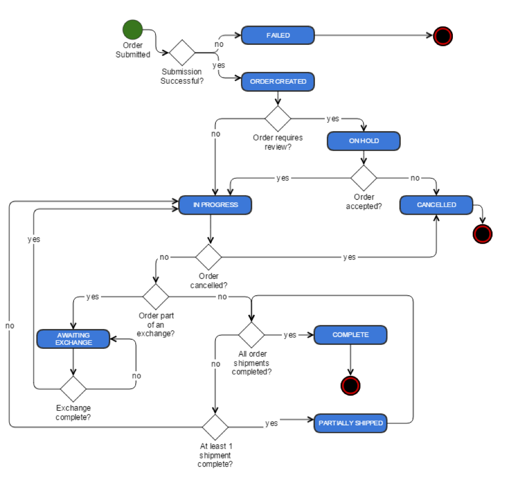
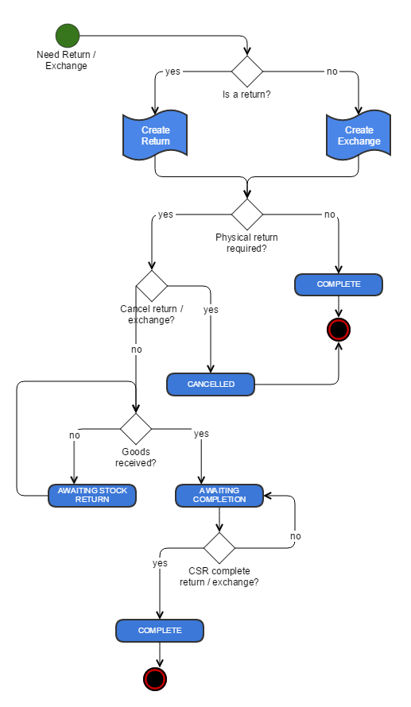

# Chapter 7: Customer Service

[TOC]

## Overview

Customer Service is intended for the use of customer service representatives (CSRs). It enables users to manage all aspects of orders and customer profiles, and can be accessed on the toolbar by clicking the **Customer Service** button.

Every processed customer order is assigned to the store in which it is created. Administrators and CSRs can only access orders from stores that they have permission to view or manage.

## Order Workflow Process

### Searching for an Order

1. On the toolbar, click the **Customer Service** button.

2. In the **Orders** tab of the **Customer Service Search** pane, enter values in the search term fields.

    > **Note**: When searching for customer information (first and last name, email, postal code, etc.), values are compared against each order&#39;s billing address.

3. In the **Sorting** section, select a field name from the **Sort By Column** list, and set the **Sort Order** (ascending/descending).

4. Click **Search**.

#### Sorting Order Search Results

The _Order Search Results_ are listed by Order ID by default. You can sort the results by clicking a column header. The results are sorted according to the column header selected.

You can sort using the following column headers:

- Order #
- Store  
- Customer Name
- Date/Time
- Total
- Order Status

### Viewing and Editing an Order

1. On the toolbar, click the **Customer Service** button.

2. In the **Orders** tab of the **Customer Service Search** pane, enter values in the search term fields.

3. Click **Search**.

4. In the **Order Search Results** tab in the top right pane, double-click the order you want to view.

5.  In the bottom pane (depending on the state of the order and your privileges), you may edit an order&#39;s details as required:

    | **Tab** | **Order Information and Functions** |
    | --- | --- |
    | Summary | Cancel the order, place the order on hold, remove the order hold, edit the customer profile, and edit the customer&#39;s address. |
    | Details | Modify the contents of the order (if the shipment is not released yet), edit shipping address(es) (if the shipment is not released yet), cancel the shipment, create a return, create an exchange, and view the products in the order. If there is personalization information attached to the order items, you can access it from this tab by selecting the item and clicking **Item Detail**. **Note**: You cannot edit personalization information from within Elastic Path Commerce. |
    | Payments | View the payment history and summary. |
    | Returns and Exchanges | View and manage the returns and exchanges. |
    | Notes | View the order notes in detail. |

6. On the toolbar, click **Save**.

## Order Auditing

Information about the various events that occur in an order&#39;s lifetime is tracked for auditing purposes. This includes details about returns, exchanges, and refunds.

Events are recorded regardless of who initiated the action or how it occurred. Everything from order creation in the store to a CSR&#39;s modifications is tracked. CSRs may add their own comments to orders, and these comments are also included in the auditing information.

Any user with the appropriate authorization may view the entire audit history of an order. The system provides a reverse chronological display of events, detailing the date-time, event creator, and event action. This allows CSRs to quickly scan the entire history of an order.

## Order Locking

The idea behind &quot;locking&quot; orders is to prevent multiple CSRs from modifying the same data simultaneously. This can cause unexpected behavior and result in corrupted data. When a CSR opts to edit an order, it is automatically locked. Until the order is unlocked, no one else is allowed to edit it.

Consider the scenario two CSRs - Bob and Ann. They both want to modify the same order - Order ABC. Ann is the first to begin editing, so the order is locked. When Bob attempts to enter the edit screen for Order ABC, he is denied by the system: an error dialog box explains that someone else is modifying that order, and that he can only view it in read-only mode. After Ann performs an action that causes the order to get unlocked, Bob can then modify Order ABC.

Consider another scenario - Assume that Bob opens Order ABC for viewing when it is locked by Ann. Ann makes changes to the order and saves it, causing the order to get unlocked. Bob then sees an error dialog box that relays the following information: &quot;Order ABC cannot be edited as another user has made changes.&quot;  The dialog box allows Bob to either &quot;Reload&quot; (which refreshes the product page and allows Bob to modify the order), or &quot;Cancel&quot; (which closes the dialog box.)  This ensures that Bob does not modify any outdated data.

An order is unlocked under the following circumstances:

| **CSR Action** | **System Action** |
| --- | --- |
| CSR saves order | The system automatically unlocks the given order, on completion of the save transaction. |
| CSR closes order editor (saves changes on prompt) | The system automatically unlocks the given order, on completion of the save transaction. |
| CSR closes order editor (abandons changes on prompt) | The system automatically unlocks the given order. |
| CSR closes Elastic Path Commerce (with open orders and saves changes on prompt) | The system automatically unlocks each order, on completion of the save transaction. |
| CSR closes Elastic Path Commerce (with open orders and abandons changes on prompt) | The system automatically unlocks each order. |

### Order Lock Indicator

A locked order&#39;s status is indicated onscreen by a closed padlock icon and the name of the CSR who locked it. An unlocked order is accompanied by an open padlock icon on the order page. If changes are made, the order automatically locks and the padlock icon changes to its closed form. The name of the CSR is also displayed next to the padlock.

### Unlock Orders Privilege and Special Situations

Occasionally, special situations arise that call for the manual unlocking of an order. For example, a CSR may be in the middle of editing an order when she falls ill and leaves the office; however, she leaves the editor open, so the order remains in a locked state.

In these and other special situations, a supervisor with the correct role – one that grants them the _Unlock Order_ privilege – may forcefully unlock the order. More specifically, supervisors who open a locked order see the **Unlock Order** button. If this is clicked, the lock on the order is removed. The **Unlock Order** button is not visible to users without the correct credentials.

Let us presume the supervisor makes changes to the now unlocked order. When the original CSR returns to work the following morning and tries to commit her changes, she sees an error dialog box alerting her to the fact that the order is modified since the page was loaded. This prevents her from overwriting the changes that someone else has made to that order. She now has to reload the order, which will give her the opportunity to note any updates and take them into consideration before (and if) she makes any further  modifications.

If a CSR&#39;s computer crashes while they are in the middle of editing an order, it is possible for them to resolve the issue without having to ask a supervisor to use their _Unlock Order_ privilege. They simply reload the Elastic Path Commerce browser session, search for the order they were modifying, open it, complete modifying it, and save the order.

### Unlocking an Order

You can search for the order you want to unlock and double-click it to view it. Assuming you have the proper credentials, click the **Unlock Order** button in the top rcorner of the tab.

## Splitting a Shipment

You can &quot;split&quot; shipments to improve customer satisfaction. Splitting a shipment refers to the formation of multiple shipments based on the components of a single, original order. These new shipments can then be shipped to either a single address or to multiple addresses. This feature is particularly useful for orders that include pre-ordered or back-ordered items. In-stock items can be shipped immediately, while preordered and/or backordered items are delivered at a later date.

Customers cannot split shipments themselves. Only CSRs and other authorized personnel may perform this action for them, so customers must call in to request this feature.

1. On the toolbar, click the **Customer Service** button.

2. In the **Orders** tab of the **Customer Service Search** pane, enter values in the search term fields.

3. Click **Search**.

4. In the **Order Search Results** tab in the top right pane, double-click the order you want to view.

5. In the bottom pane, click the **Details** tab.

6. Select the components you want to split from the original order.

7. Click **Move Item**.

8. In the _Move Item_ dialog box, select the address the new split shipment should be delivered to and the shipment method to use.

    > **Note:** If the address you want to enter is not present in the list, you can configure it in the next step.

9. Click **OK**.

    > **Note:** There is now a separate Shipping Information section for each split shipment you create. You may edit the shipping address of any of the split shipments as required, allowing you to add new delivery addresses.

## Returns, Exchanges and Refunds

CSRs and warehouse staff may perform and accept returns, respectively. Returns and exchanges maximize user satisfaction and increase buyer confidence and sales.

Only authorized CSRs can create a return or exchange. The system automatically creates a unique code, called the Return Merchandise Authorization (RMA) code, for all such transactions. Typically, the RMA number is recorded on the physical return to assist warehouse employees in matching the receipt of the return to the correct customer account.

The process for completing a &#39;Shippable&#39; versus a &#39;Digital Asset&#39; SKU is slightly different, because for digital assets there is no requirement to receive the returned good prior to completing the return.

Regardless of the nature of the SKU, for each item being returned, the CSR must enter the following details:

- **Quantity being returned** : The number of items being returned.
- **Reason for return** : Select from a list of both system defined and custom reasons (for example, Damaged, Defective, Unwanted Gift, Wrong Size.)
- **Comments** : CSR comments about the return item (for example, &quot;Customer no longer has the original packaging&quot;.)

For shippable items, the CSR must specify whether the returned products must be physically received back into the warehouse or not before completing the processing of the return.  For digital assets, there is nothing to physically receive, so the return is processed immediately.

For shippable SKUs, the customer may want a refund or they may want to exchange what was received for something else.  Depending upon their selection, the CSR has the following additional steps to perform:

- **Refund** : The CSR must enter a refund amount to be credited to the customer. The system suggests a figure based on the purchase price, the promotions at the time of the order, and taxes.
- **Exchange** : The CSR must select a SKU to exchange the incoming product for. By default, the system suggests the same SKU as the one being returned.

For digital assets, only refunds are issued as part of a return.

Usually refunds are credited to the purchase medium used in the original purchase. However, in special situations, CSRs may issue a refund to another payment source. For example, if the buyer used a now-expired credit card for the purchase, a CSR may issue the refund to another credit card.

## Shippable Good Returns and Exchanges Workflow

The following diagram shows the workflow for returns and exchanges of shippable items.

### Searching for a Return or Exchange Order

When performing a return or exchange for a shippable item, the item originally received by the customer may be required to be returned to the warehouse before the return is completely processed.  To process the item that is returned to the warehouse, the corresponding RMA must be found.

1. On the toolbar, click the **Shipping/Receiving** button.

    

2. In **Warehouse** pane, click the **Returns** tab.

3. In the **Search Terms** section, enter the search terms and click **Search**.

    > **Note:** Entering more search terms narrows your search results.

## Digital Asset Return

To create a return for a digital asset, do the following:

1. On the toolbar, click the **Customer Service** button.

2. In the **Orders** tab of the **Customer Service Search** pane, enter values in the search term fields.

3. Click **Search**.

4. In the **Order Search Results** tab in the top right pane, double-click the order you want to view.

5. In the bottom pane, click the **Details** tab.

6. In the **E-shipment** section, click **Create Return**.

7. In the _Create Return_ wizard, enter the return quantity value for the item to return, and select the corresponding reason in the given fields.

    > **Note**: If desired, you can enter notes or additional information in the **Notes** field.

8. Click **Next**.

9. In the _Create Return_ wizard, select the payment source to which the refund should be issued.

    > **Note**: The **Manual Refund** option is used if some other mechanism is to be used for the refund, such as, issuing a check.

10. Click **Next** to complete the return.

    > **Note**: The refund is now listed on the **Returns and Exchanges** tab for the order.

11. Click **Finish**.

## Creating a Refund

At times, a refund may need to be issued outside of a return being performed. For example, a customer is very unhappy with service, and so as an act of goodwill, the CSR may want to make amends to the customer by giving them some funds back.  Only CSRs who are granted the _Can Create Refund_ permission can perform this function. This kind of refund can be created at any time for an order and is not dependent upon the shipment status.

1. On the toolbar, click the **Customer Service** button.

2. In the **Orders** tab of the **Customer Service Search** pane, enter values in the search term fields.

3. Click **Search**.

4. In the **Order Search Results** tab in the top right pane, double-click the order you want to view.

5. In the bottom pane, click the **Details** tab for the order.

6. In the **Details** tab, click the **Create Refund** button.

7. In the _Refund Amount_ wizard, enter the currency amount you are refunding to the customer.

8. In the **Refund Options** area, select the payment source to which you will credit the refund.

9. Click **Next** to complete the refund.

10. Click **Finish**.

## Customers

Customers must register before their purchases are completed. Even if the registration is anonymous (i.e., their personal information is not added to the retailer&#39;s customer data, they will have to reenter the information for their next purchase.)  Registered accounts are stored in the system, and may be accessed and modified by authorized users.

One of the customer attributes you can modify is the _Customer Status_. You can set it to one of the following:

- Active - The customer is able to log on to the store and purchase products.

- Disabled - The customer is not able to log on to the store to purchase products.

### Disabling a Customer account

You cannot delete customer accounts from the system. This is to ensure complete audits and informational integrity (for example, a customer&#39;s orders cannot be orphaned.)

Disabling a customer is, from the shopper&#39;s perspective, equivalent to deleting their account from the system, but with the benefit of being able to easily change the status back to Active.

Only authorized CSRs may disable customers.

### Searching for a Customer account

1. On the toolbar, click the **Customer Service** button.

2. In the **Customer Service Search** pane, click the **Customers** tab.

3. In the **Search Terms** section, enter the search terms in the fields to narrow your search.

4. In the **Sorting** section, select to sort by heading from the **Sort By Column** list, and set an ascending/descending **Sort Order**.

5. Click **Search**.

#### Sorting Customer Search Results

By default, customers are listed in the search results by their _User ID_. You can re-sort the results by clicking a column header. The results are sorted according to the column header selected.

You can sort customer search results using the following column headers:

- User ID
- Default Billing Address
- Email Address
- First Name
- Last Name
- Telephone #

### Editing a Customer account

1. On the toolbar, click the **Customer Service** button.

2. In the **Customer Service Search** pane, click the **Customers** tab.

3. In the **Search Terms** section, enter the search terms in the fields to narrow your search.

4. In the **Sorting** section, select a sort order by heading from the **Sort By Column** list and set a **Sort Order**.

5. Click **Search**. The search results are listed in the **Customer Search Results** tab on the top right pane.

6. Double-click the customer account you want to edit.

7. Depending on your privileges, you may edit a customer&#39;s information as required:

    | Tab | Customer Information and Functions |
    | --- | --- |
    | **Customer Profile** | Manage a customer&#39;s attributes (except address-related information), their preferred locale, and other registration information.   **Note:** When selecting a preferred language, ensure that you also select the correct locale. Depending on the locale, your prices are displayed differently. For example: With the US locale, your price appears as $14.25.|
    | **Addresses** | Manage a customer&#39;s address(es), and sets the customer&#39;s default billing and shipping addresses. |
    | **Credit Cards** | Manage a customer&#39;s credit cards and sets their default credit card. |
    | **Orders** | View the details of a customer&#39;s order(s) and creates an order for the customer. |
    | **Customer Segments** | View the customer segments a customer belongs to and add new customer segments. |
    | **Customer Data Policies** | View data policies that apply to a customer, data points collected for a data policy, and remove a customer's data. |

8. On the toolbar, click **Save**.

### Resetting a Customer&#39;s Password

1. On the toolbar, click the **Customer Service** button.

2. In the **Customer Service Search** pane, click the **Customers** tab.

3. In the **Search Terms** section, enter the search terms in the fields to narrow your search.

4. In the **Sorting** section, select a sort order by heading from the **Sort By Column** list and set a **Sort Order**.

5. Click **Search**. The search results are listed in the **Customer Search Results** tab on the top right pane.

6. Double-click the customer account you want to edit.

7. In the bottom pane, click **Reset Customer Password**.

8. In the _Customer Password Reset - Confirm_ dialog box, click **OK**.

      > **Note**: An e-mail containing a new, system-generated password is automatically sent to the customer.

### Customer Segments

By default, all customers are assigned the PUBLIC customer segment.  You can add and remove new customer segments to a customer, but you cannot remove the PUBLIC customer segment.

#### Adding a Customer to a Customer Segment

1. On the toolbar, click the **Customer Service** button.

2. In the **Customer Service Search** pane, click the **Customers** tab.

3. In the **Search Terms** section, enter the search terms in the fields to narrow your search.

4. In the **Sorting** section, select a sort order by heading from the **Sort By Column** list and set a **Sort Order**.

5. Click **Search**. The search results are listed in the **Customer Search Results** tab on the top right pane.

6. Double-click the customer account you want to edit.

7. In the bottom pane, click the **Customer Segment** tab.

8. Click **Add Segment**.

9. In the _Add Customer Segment Membership_ dialog box, select the **Segment Name** from the list.

10. On the toolbar, click **Save**.

#### Removing a Customer from a Customer Segment

1. On the toolbar, click the **Customer Service** button.

2. In the **Customer Service Search** pane, click the **Customers** tab.

3. In the **Search Terms** section, enter the search terms in the fields to narrow your search.

4. In the **Sorting** section, select a sort order by heading from the **Sort By Column** list and set a **Sort Order**.

5. Click **Search**. The search results are listed in the **Customer Search Results** tab on the top right pane.

6. Double-click the customer account you want to remove.

7. In the bottom pane, click the **Customer Segment** tab.

8. Click **Remove Segment**.

9. In the _Remove Customer Segment Membership - Confirm_ dialog box, click **OK**.

10. On the toolbar, click **Save**.

### Customer Data Policies

You can use the **Customer Data Policies** tab to manage the data policies that apply to a customer, as well as the data associated with those data policies.

The **Customer Data Policies** tab shows:

* Data policies that apply to a customer.
* Whether a customer has given consent to a data policy.
* When their consent was last updated.
* The status of the data policy.

#### Viewing a Data Policy's Data Points

1. On the toolbar, click the **Customer Service** button.

2. In the **Customer Service Search** pane, click the **Customers** tab.

3. In the **Search Terms** section, enter the search terms in the fields to narrow your search.

4. In the **Sorting** section, select a sort order by heading from the **Sort By Column** list and set a **Sort Order**.

5. Click **Search**. The search results are listed in the **Customer Search Results** tab on the top right pane.

6. Select a customer account. In the bottom pane, the **Customer** tab appears.

7. In the bottom pane, click the **Data Policies** tab.

8. Select the data policy you want to view data points for.

9. Optionally, to view data points for a disabled data policy, select the **Show disabled data policies** checkbox.

10. Click **View Data Points**.

#### Removing Customer Data

1. On the toolbar, click the **Customer Service** button.

2. In the **Customer Service Search** pane, click the **Customers** tab.

3. In the **Search Terms** section, enter the search terms in the fields to narrow your search.

4. In the **Sorting** section, select a sort order by heading from the **Sort By Column** list and set a **Sort Order**.

5. Click **Search**. The search results are listed in the **Customer Search Results** tab on the top right pane.

6. Select a customer account. In the bottom pane, the **Customer** tab appears.

7. In the bottom pane, click the **Data Policies** tab.

8. Select the data policy to remove data points for.

9. Optionally, to view data points for a disabled data policy, select the **Show disabled data policies** checkbox.

10. Click **Delete Policy Data**.

A data point value is only removed if it is indicated as removable by the data policy, and a customer does not have active consent for the same data point recorded in another data policy.
