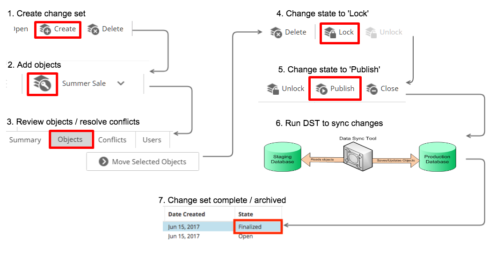
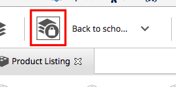

# Chapter 10: Change Sets

[TOC]

## Overview

Assume that you need to change prices for 200 different products in your storefront on a specific date. You could change each price on your production server on that date, but that would be a very time-consuming process. Also, if you make any mistakes, they would immediately display to the shoppers, which could negatively impact your business.

A better practice is to apply your changes in a staging environment, validate the changes, and then move the changes in bulk to the production environment. However, managing changes across environments can be also complicated and time-consuming. How do you know which objects are ready to move to production? After you have applied changes to your staging environment, how do you prevent modified objects from being changed again before they are moved to the production environment?

_Change Sets_ allow you to group objects and control who can modify them. After making changes to objects in a change set, you can lock the change set to prevent any further changes. Then, using the Data Sync Tool, you can move the changed objects to your production environment. After the changes are applied to your production environment, you can unlock the change set and make the objects available again for editing.

When an object is assigned to a change set, the change set&#39;s status determines if the object can be modified. There are four change set states:

| **State** | **Icon** | **Description** |
| --- | --- | --- |
| OPEN |  | The change set is open. Users with the appropriate permissions can add and edit objects in the change set. When an object is added to the change set, you cannot add it to any other change set until it is finalized. |
| LOCKED |  | The change set is locked. You cannot add objects to the change set. You cannot modify objects in the change set until the change set is finalized. |
| PUBLISHING |  | The change set is set for publishing. This is the state that the Data Sync Tool looks for when moving objects from one environment to another. You cannot modify objects in the change set until the change set is finalized. |
| FINALIZED |  | The change set is finalized and all the objects are synchronized to the production server. After a change set is finalized, you can add its objects to other change sets and edit it. |

> **Note**: If change sets are enabled, users must select a change set before they can create certain types of business objects, including products, categories, and promotions.

## Change Set Workflow

The Change Set workflow is as follows: You create a change set within Elastic Path Commerce, name the change set, and add items to the change set that you want to move to the production environment.

Change sets are used with Elastic Path Commerce&#39;s _Data Sync Tool_— a tool for synchronizing changes between Elastic Path Commerce deployments. The typical workflow for this process is illustrated below. As shown, after you have created a change set, made your changes, and locked the change set, you use the Data Sync Tool to export the modified objects from the source system and import them to a target system. During import, the Data Sync Tool merges the changes for each object in the change set with the object in the target system.

The Data Sync Tool can export and import change sets in one step, or if the source and target systems cannot communicate directly (due to firewall rules), in two steps. In the case of a two-step export/import, run the Data Sync Tool from a location that has access to the source&#39;s database. The change set data exports to the Data Sync Tool file system. Then, you can move the exported package to another machine where the Data Sync Tool has access to the target&#39;s database.

When you synchronize a change set, the items belonging to the change set on the source system normally change from a _Locked_ to a _Finalized_ state. However, the use of the change set status workflow can be customized to your organization. For example, while one retailer may want the items in a change set to be &quot;Finalized&quot; immediately after the change set is successfully moved, another retailer might want the change set to stay in a _Locked_ state on the source system awaiting further verification.

### User Permissions

To perform tasks with change sets, a user needs _Change Set_ permissions. To view a change set, you must be associated to that change set. On creating a change set, you are automatically associated to that change set and are able to associate additional users to the change set. You cannot see change sets that you are not associated to (either as a creator or through assignment to the change set by the creator). For information on adding other users to the change set, see the **Change Set Users** tab.

## Supported Change Set Objects

An up-to-date list of the supported change set objects is available in the _Import Export Tool Guide_ at http://developers.elasticpath.com.

Elastic Path Commerce can be extended to support other objects types in change sets. For more information, see the _Data Sync Tool Guide_ at http://developers.elasticpath.com.

## Object Dependencies

When adding and moving objects in change sets, it is important to be aware of the relationships between different objects, because some objects have dependencies on other objects. When the Data Sync Tool is used to move objects from one deployment to another, all the dependencies of that object must exist on the target deployment. If not, the operation fails. For example, you want to move a new product from the staging environment to the production environment. The category that contains that product is also new and does not exist on the production environment yet. If you attempt to move the product to production before moving the category, the operation fails.

You can configure the dependent objects that are included when using the Data Sync Tool. For more information, see the latest version of the _Staging to Production Guide_ at http://developers.elasticpath.com.

## Enabling Change Sets

You need to enable the change sets feature before it can be used. You can enable change sets as follows.

1. Log on to Elastic Path Commerce as a user with _administration_ permissions.

2. On the toolbar, click the **Configuration** button.

3. In the left pane, under **System Administration**, click **System Configuration**.

4. In the list of settings on the top right pane, filter the list of settings to find `COMMERCE/SYSTEM/CHANGESETS/enable`.

5. In the filtered list of results, select `COMMERCE/SYSTEM/CHANGESETS/enable`

6. To the right of the list, in the **Defined Values** section, click **New**. The _Add Configuration Value_ dialog box appears.

7. Enter the value.

8. Click **Save**.

After enabling change sets in Elastic Path Commerce, you _must_ have your system administrator restart the Elastic Path Tomcat server for the change sets to be visible to other users of Elastic Path Commerce.

> **Note**: Users must have the _Change Set_ permission to be able to work with change sets.

## Creating a Change Set

1. On the toolbar, click the **Change Set** button.

2. In the left pane, click **Search**. The **Change Set Search Results** tab appears in the right pane.

3. On the top right pane toolbar, click **Create**. The _New Change Set_ dialog box appears.

4. Enter a name and description for the change set and click **Finish**. The new change set appears under the **Change Set Search Results** tab in the top right pane. You can now view and add items to the change set.

## Viewing a Change Set

1. On the toolbar, click the **Change Set** button.

2. In the **Change Sets Search** tab on the left pane, set **Change Set State** to **All States** (or a specific state to narrow the search results), and click **Search**. The search results appear in the right pane.

3. Double-click the change set you want to view. The change set details appear in the bottom right pane.

4. Click the **Objects** tab to view the objects assigned to the change set.

The following table describes the change set object properties.

| Property | Description |
| --- | --- |
| **Selected** | Selects a change set object. You can move the selected objects to the other change sets using the **Move Selected Objects** button.
| **Change Type** | Displays icons describing the change set object&#39;s type.  - Edit icon –Edited object. -    Remove icon – Deleted object.  - Add icon – New object. |
| **Object Code** | Lists the change set object&#39;s code, which is a unique identifier in Elastic Path Commerce. |
| **Object Name** | Lists the name of the object. |
| **Object Type** | Lists the object&#39;s type. |
| **Date Added** | Lists the day the object got added to the change set. |
| **Added By** | Lists the user role of the person that added the object to the change set. |
| **Move Selected Objects** | Moves the selected change set objects to a different change set. |
| **Open Object** | Opens the change set object for editing. |

## Adding Objects to a Change Set

You can add a variety of objects to a change set. After an object is added to a change set, you can edit the object. For a list of objects supported by change sets, see the _Supported Change Set Objects_ section. See the following sections for steps on adding a new object to a change set and adding an existing object to a change set.

> **Note**: The following steps assume you have _Change Set_ permissions, you have enabled change sets (see _Enabling Change Sets_), and you have created a change set (see _Creating a Change Set_).

### Adding a New Object to a Change Set

The steps for creating a new object (product, catalog, price list, category type, etc) for a change set are the same steps you normally follow for creating the object, except for the first step when you select the change set to create the object for. See the other sections in this manual for steps on creating products, catalogs, price lists, etc. The following steps serve as a guideline for creating new objects for change sets.

1. Select the change set from the **Change Set** list.

2. Create the object. See the appropriate section in this manual for steps on creating your object.

    After you create the object, the new object is added to the selected change set. For information on viewing the objects in the change set, see _Viewing a Change Set_.

    > **Note** :Objects in Elastic Path Commerce with the Lock icon  show that the object is part of a Change Set.

### Adding an Existing Object to a Change Set

1. Select the change set from the **Change Set** list.

2. In Elastic Path Commerce, navigate to the object you want to add to the change set and select it.

3. Click the **Add to Change Set**  button.

The object is added to the selected change set. For information on viewing the object in the change set, see _Viewing a Change Set_.

#### Example: Adding an existing Object to a Change Set

The following example describes how to add an existing product to a change set.

1. On the toolbar, click the **Catalog Management** button.

2. In the **Catalog** tab, double-click the category that contains the product. The **Product Listing** tab appears in the top right pane.

3. If a change set exists, select your **Change Set** from top right pane toolbar. If there is more than one change set, it appears as a menu.

4. Select the product in the **Product Listing** tab. The **Add to Change Set** button on the top menu bar becomes active showing a key .

5. Click the **Add to Change Set** button.
  * The selected product is added to the change set.
  * The **Add to Change Set** button changes from a key to a lock as follows:

      

6. Double-click the product in the **Product Listing** tab. The product details are displayed. Click the **Assigned Change Set** tab.

7. The following change set information is displayed:

    * the change set the product is assigned to
    * the state of the change set
    * who added the product to the change set
    * the date the product was assigned to the change set.

## Deleting Objects Using a Change Set

You can delete objects from your production server using change sets. To delete an object, add the object to a change set, delete the object in Elastic Path Commerce, and then use the Data Sync Tool to remove the object from the production server.

> **Note** :The steps below assume you have _Change Set_ permissions, you have enabled change sets (see _Enabling Change Sets_), and you have created a change set (see _Creating a Change Set_).

1. Use the **Change Set** list to select the change set.

2. Navigate to the object and select it.

3. Click the **Add to Change Set** button to add the object to the change set and enable the object&#39;s **Delete** button.

4. Click the object&#39;s **Delete** button.

    The object is now set for deletion in the selected change set. A remove icon  displays next to the object in the change set. This icon indicates the object is removed from the production server during synchronization. See _Viewing a Change Set_ for steps on viewing change set objects.

> **Note** :If you are deleting a brand and the brand is part of a promotion or product, the Data Sync tool does not remove the brand from the production server. You must remove all the brand dependencies before removing the brand.

## Editing Change Sets

You can make changes to change sets that are in the _Open_ state. When the change set is in the _Open_ state, you can move objects to other change sets, edit objects, resolve conflicts, and assign users to the change set.

> **Note:** You cannot modify a Change Set that is _Locked_ or _Finalized_.

1. On the toolbar, choose the **Change Set** button.

2. On the **Change Sets Search** tab, click **Search**.

  The Change Set Search Results list appears in the top right pane.

3. Select the change set you want to modify, and then click **Open** in the top right pane toolbar.

    The Change Set panel appears. The panel has four tabs: Summary, Objects, Conflicts, and Users.

      * The **Objects** tab shows the objects in the change set. You can double-click any object to edit it. You can also move objects to other change sets.
      * The **Conflicts** tab displays objects that may be in conflict with objects in other change sets, giving you the opportunity to resolve issues before attempting to sync data to another deployment.
      * The **Users** tab allows you to add and remove user permissions for the change set.

4. In each tab, you can make the following changes:

    | **Tab** | **Actions** |
    | --- | --- |
    | Summary | - Modify the **Change Set Name** entry.  - Change the **Description** entry. |
    | Objects | - Edit an object included in the change set: Edit parameter values for objects in the change set. For example, there are 20 products whose prices are increasing in two weeks. You added the products to a change set, but have not yet changed their prices. Click **Open Object** to open each product&#39;s detail window and change the product price. Ensure to save your changes when you are done editing each product.   - Move the object(s) in a change set to another change set: You may need to reassign an object from the current change set to another change set. To do this, select the option for the object(s) you want to reassign, and then click **Move Selected Objects**. In the _Move Objects_ dialog box, select the target change set, and then click **Move**. (Note that only the change sets with a status of _Open_ are available.) |
    | Conflicts | Use this tab to ensure that the objects in this change set are not in conflict with objects in other change sets. (Currently, only conflicts between catalog objects are checked.) |
    | Users | Use this tab to assign users to this change set. Assigned users can view and modify the open change set.   - To assign a user, click a user name in the **Available Users** list, then click the forward arrow    - To un-assign a user, click a user name in the **Assigned Users** list, then click the back arrow. |

  5. On the toolbar, click **Save**.

## Deleting a Change Set

You can delete change sets only if they do not have any objects assigned to them. (You can delete a change set if there are users assigned to it.)

1. On the toolbar, click the **Change Set** button.

2. In the **Change Set** tab on the left pane, click **Search**. The **Change Set Search Results** tab appears in the top right pane.

3. Select the change set you want to delete and click **Delete**.

The deleted change set is removed from the list.

## Moving Objects to another Change Set

You may need to move an object from one change set to another. This might occur if the object is inadvertently assigned to the wrong change set.

> **Note** :Both the change sets must be in the _Open_ state.

1. On the toolbar, click the **Change Set** button.

2. In the **Change Set** tab on the left pane, click **Search**. The **Change Set Search Results** tab appears in the top right pane.

3. Double-click the change set containing the object(s) you want to move. The selected change set opens.

4. Click the **Objects** tab.

5. Select the options for the object(s) you want to reassign, and then click **Move Selected Objects**.

6. In the _Move Objects_ dialog box, select the target change set and click **Move**. (Note that only the change sets in the _Open_ state are available.)

The moved object is removed from the current change set and reassigned to the target change set.

## Checking for Conflicts

When you have finished making changes to the objects in a change set and you want to move those changes to another deployment, verify that there are no conflicts. Conflicts occur if an object in one change set depends on an object in another change set.

1. On the toolbar, click the **Change Set** button.

2. In the **Change Set** tab on the left pane, enter the change set name, and click **Search**.

3. Double-click the change set you want to check for conflicts.

4. Click the **Conflicts** tab. A list of conflicts is generated. (This may take a while if there are many change sets containing many objects.)

    * The first column in the list indicates the name of the object in this change set with the conflict.
    * The third column indicates the object that it depends on and that is currently in another open or locked change set. If you have the appropriate permissions, you can click **Dependency Name** to display the object&#39;s details.
    * The fifth column contains the name of the conflicting change set. If you have the appropriate permissions, you can click the name to display the change set&#39;s details.

The manner in which you resolve the change set conflicts depends on your organization&#39;s policies. A large organization may have many change sets with different owners, and you may need to communicate with the other change set owners to decide how to resolve conflicts.

## Locking a Change Set

When you have finished making changes to the objects in a change set, you can lock it to prevent further changes.

> **Note**: Before locking a change set, we recommend that you check for conflicts, especially if you are planning to use the Data Sync Tool to move those changes to another deployment. The conflicts may cause the sync operations to fail.

1. On the toolbar, click the **Change Set** button.

2. In the **Change Set** tab on the left pane, enter the change set name, and click **Search**.

3. From the list in the left pane, select the change set you want to lock.

4. Click **Lock** in the top right pane toolbar.

The Change Set is now locked and no further changes can be made to the object until it is either unlocked or finalized.

### Unlocking a Change Set

If you have locked a change set, but you need to make changes to it again, you can unlock it. This moves it back to the _Open_ state.

1. On the toolbar, click the **Change Set** button.

2. In the **Change Set** tab on the left pane, enter the change set name, and click **Search**.

3. From the list in the left pane, select the change set you want to unlock.

4. Click **Unlock** in the top right pane toolbar.

The Change Set is now in the _Open_ state and you can make changes to it.

## Publishing a Change Set

In most environments, the Elastic Path Data Sync Tool is used to move change set objects into your production environment.

1. On the toolbar, click the **Change Set** button.

2. In the **Change Set** tab on the left pane, enter the change set name, and click **Search**.

3. From the list in the left pane, select the change set you want to publish.
  > **Note**: A change set must be in the **Locked** state to get published.

4. Click **Publish** in the top right pane toolbar.

The Change Set is now in the _Publishing_ state. When complete, it gets automatically placed in the _Finalized_ state, and all the objects in the change set are unlocked.

## Finalizing a Change Set

When you are ready to release the objects in a change set (usually after the changes are applied to the target environment), you finalize the change set.

1. On the toolbar, click the **Change Set** button.

2. In the **Change Set** tab on the left pane, set the **Change Set State** to **Locked**.

3. From the list in the left pane, select the change set you want to finalize.

4. Click **Finalize**.

The change set is now finalized and its objects are released. After it is finalized, you cannot modify the change set. **Note:** For auditing purposes, the objects continue to be part of this change set, but they can now be added to another change set and modified.

## Data Sync Tool

The Data Sync Tool is a utility designed to move change set objects from one Elastic Path Commerce instance to another. The typical usage scenario for the Data Sync Tool is for syncing changes between the staging and production systems.

For information on running the Data Sync Tool, see the _Data Sync Tool Guide_ at http://developers.elasticpath.com.
