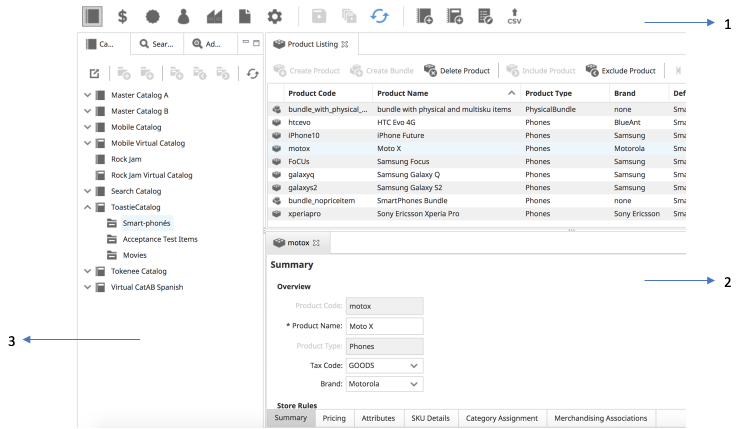

# Chapter 2: Getting Started

[TOC]

## Browser Requirements
Elastic Path Commerce is compatible with the following browsers at a screen resolution of at least 1366x768:

- Google Chrome
- Microsoft Internet Explorer 11
- Microsoft Edge

## Logging in to Elastic Path Commerce

The login URL for Elastic Path Commerce varies from environment to environment based on your system setup. Your system administrator will provide you with the URL to log in to Elastic Path Commerce.

1. Using a web browser, navigate to the Elastic Path Commerce login URL.
2. On the Login screen, enter your user name and password.
3. Click **Login**.

### Account Locking after Failed Login

By default, if you are unable to log in to Elastic Path Commerce after six attempts, your account gets locked. If this occurs, you must ask an Elastic Path Commerce user with administrator privileges to unlock it. When your account is unlocked, your password is reset and you will receive an e-mail containing the new password. You will be able to log in with this password one time only and must change it immediately after logging in.

## Elastic Path Commerce User Interface

The Elastic Path Commerce user interface is divided into the following sections.

|Callout | Pane | Description |
|---  | ---     | ---         |
| 1 |Toolbar | Provides navigation icons for each activity in the application, and icons for activity-specific actions. The **User** menu on the upper right corner in the right pane provides links to the Help documentation, pagination settings, time zone settings, and account password settings. |
| 2| Right Panes | Changes based on the activity. Typically, the top right pane displays search results or a listing of items, and the bottom right pane displays information about a specific item or search result. |
| 3 | Left Pane | Contains search or navigation options for an activity. |

> **Note**: You can resize a pane by clicking and dragging right, left, up, or down on the division frames between each pane. You can also quickly resize a pane by clicking the minimize and maximize buttons in the upper right of each pane.

## Activities

There are seven main activities in Elastic Path Commerce. Each is represented by an icon in the main toolbar. Depending on your user role and permissions, you may not have access to some of them.

The Elastic Path Commerce web application is subdivided into seven activity types. The following table describes the activities:

| **Activity**       | Icon | **Description**                                 |
| ---                | ---  |  ---                                          |
| Catalog Management |  | Enables authorized users to create and manage categories and products. |
| Price List Manager | | Allows authorized personnel to manage price lists and assign them based on conditions. |
| Promotions/Shipping    |  | Enables authorized personnel to set store promotions and configure shipping services. |
| Customer Service   |  | Allows CSRs to manage orders and customers. |
| Shipping/Receiving |  | Enables users to manage warehouses and inventory, and to generate and packing slips. Orders, returns, and exchanges are also all completed in this activity. |
| Configuration      |  | Allows administrators and other authorized personnel to configure system and store settings. These items include payment gateways, shipping regions, users and user roles, tax-related settings, and profile attributes. |
| Reporting      |  | Allows administrators and other authorized personnel to generate various reports. |
| Change Sets        |  | Allows authorized personnel to create and delete Change Sets. (Note that this menu item is only enabled if the `COMMERCE/SYSTEM/CHANGESETS/enable` setting is set to _true_. |

  <!--| Reporting          | | Allows users to generate and view various store reports. |-->

## Saving Changes

Elastic Path Commerce does _not_ automatically save changes made. The **Save** and **Save All** buttons in the toolbar highlight in blue to indicate that you have made a change that should be saved.

