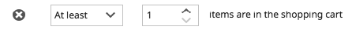
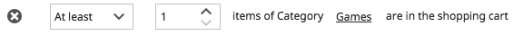
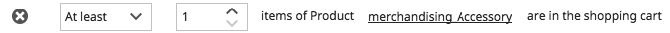
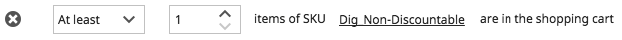
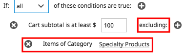
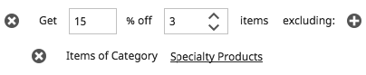
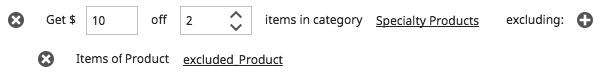
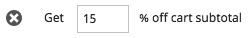
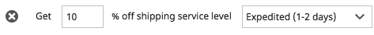
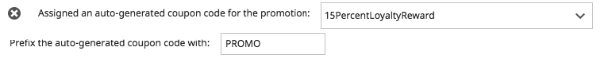

# Appendix E: Promotion Shopper Segment Conditions and Rules

[TOC]

## Overview

The following tables describe the different shopper segment conditions and promotion rules that can be used when configuring promotions.

## Shopper Segment

Shopper segment information can be used to determine who is eligible for a given shopping cart promotion.

### Browse Behavior

Browse behavior information is collected as the shopper navigates the storefront.

| **Tag name** | **Description** |
| --- | --- |
| **have**** searched in the store for phrase**(string) | The search terms that the shopper enters in the storefront **Search** field. For the search terms to be recorded, the shopper must actually click the **Search** button. **Note**: The search terms are overwritten each time the shopper performs a new search. |
| **have viewed**** category**(string) | The categories that the shopper views in the storefront during the current session. **Note**:A category is not tracked if the shopper navigates to a product without viewing the parent category. |
| **landed on a store page with URL** (string) | The URL that brought the shopper to the storefront. For example: [http://snapitup.elasticpath.com:8080/storefront/browse.ep?cID=100009&amp;filters=c90000003&amp;sorter=price-desc](http://snapitup.elasticpath.com:8080/storefront/browse.ep?cID=100009&amp;filters=c90000003&amp;sorter=price-desc) |
| **searched on the internet for phrase** (string) | The search terms the shoppers enters in the search engine that brought them to the storefront. Currently, this tag is designed to work with the Google, Yahoo, and MSN Live search engines. Each search engine uses a different syntax for their searches. When it encounters this tag, Elastic Path Commerce looks for search terms within the originating URL. The tag can extract those search terms from the URLs generated by Google, Yahoo, and MSN Live. |
| **were**** referred from a URL**(string) | The URL of the referring site. For example: http://www.google.ca/aclk?sa=l&amp;ai=Cu3BuHnDnSebAJ56wsAPcq-GAC6WN\_nvZ5pr\_A8nYoP4ECAAQAVCyrdOV-\_\_\_\_\_8BYP3A-4DMA6ABp8Cv\_gPIAQGqBBtP0GD2nmBaPAvT5Q8HWz\_UpVlyLbZk9rI0Peg&amp;sig=AGiWqtzbc0FN-Ac8TwPg1073g\_yo6E\_aNg&amp;q=http://www.elasticpath.com |

### Customer Profile

Shoppers who create an account can optionally provide certain personal information, such as their age and gender. If those shoppers are currently logged in, their profile information is available for use in evaluating the shopper segment.

| **Tag name** | **Description** |
| --- | --- |
| **are of**** age** (years)(integer) | The shopper&#39;s age, as computed from their birth date, if stored in their customer profile. The information from this tag is only retained while the shopper is logged in to their customer account in the storefront. |
| **are of**** gender**(string) | The shopper&#39;s gender (M/F), if stored in their customer profile.    **Note**: This value is case-sensitive and must be entered in upper case. The information from this tag is only retained while the shopper is logged in to their customer account in the storefront. |
| **are first time buyers** (boolean) | The shopper&#39;s status as a first time buyer. |
| **are registered customers** (boolean) | The shopper&#39;s status as a registered customer. The information from this tag is only retained while the shopper is logged in to their customer account in the storefront. |
| **are customer segment members** (string) | The shopper&#39;s association to the customer segment. The information from this tag determines whether or not their customer account is included as a customer segment member. |

### Geo Location

Geo location information is based on the shopper&#39;s IP address. It is only available if a third-party Geo IP service is configured. For more information, contact your Elastic Path Commerce server administrator.

| **Tag name** | **Description** |
| --- | --- |
| are browsing from a **time zone +/- offset from GMT** (string) | The shopper&#39;s time zone, relative to GMT (Greenwich Mean Time). |
| are browsing from an internet **connection of**** type**(string) | The type of connection that the shopper is using to access the storefront. Examples of connection types include: Dial up, Cable. |
| are browsing from an internet **IP routing of type** (integer) | The IP routing type of a shopper&#39;s connection to the storefront. Typical values returned for this could be _regional proxy_, _superproxy_, or _mobile__gateway_. It is useful in determining the shopper&#39;s actual location relative to the IP address returned for them. |
| are browsing from an ISP with **second level domain** (string) | The second level domain name from the shopper&#39;s connection to the storefront. The second level domain name is the portion of the Internet domain name directly above a top level domain name. It is usually the name of the organization that the domain name represents. Examples of second level domains are &quot;google&quot; and &quot;wikipedia&quot;. |
| are browsing from an ISP with **top level domain** (string) | The top level domain name from the shopper&#39;s connection to the storefront. The top level domain name is the portion of the internet domain name following the dot. Examples of a top level domain are &quot;.com&quot;, &quot;.ca&quot;, &quot;.org&quot;. |
| are browsing from **city** (string) | The shopper&#39;s city. |
| are browsing from **continent** (string) | The continent from where the shopper is connected. |
| are browsing from **country code** (string) | The two-letter code of the country from where the shopper is connected to the storefront. |
| are browsing from **state**** or ****province** (string) | The shopper&#39;s state or province. |
| are browsing from **zip/postal code** (string) | The shopper&#39;s zip/postal code. |

## Conditions

When setting up conditions for a promotion, keep the following points in mind:

- &quot;Exactly&quot; – The shopping cart must contain exactly the specified number of items. If the cart contains less or more than the specified number of items, the shopper does not meet the conditions is not eligible for the promotion.
- &quot;At least&quot; – To meet the conditions and be eligible for the promotion, the shopping cart must contain the specified number of items or more.

### Catalog Promotions

| Value | Description |
| --- | --- |
| Category is [] | Specifies a category whose products are included in the promotion.You can specify individual products and categories to be excluded from the promotion if required. |
| Brand is [] | Specifies a brand whose products are included in the promotion. |
| Product is [] | Specifies a product to include in the promotion. |

### Shopping Cart Promotions

| Value | Description |
| --- | --- |
| [] [] items are in the shopping cart | Specifies the number of items that must be in the shopping cart.        You can specify individual products, categories, or SKUs to be ignored when calculating the number of cart items. For example, in a promotion that gives a shopper a free camera bag when 3 or more items are purchased, you could set an exclusion condition to not include items from the &quot;Camera Bags&quot; categories when calculating the number of cart items. |
| [] [] items of Category [] are in the shopping cart | Specifies how many items from a particular category must be in the shopping cart.        You can specify individual products, categories, or SKUs to be ignored when calculating the number of cart items. |
| [] [] items of Product [] are in the shopping cart | Specifies the number of items of a particular product that must be in the shopping cart.        You can specify individual SKUs to be ignored when calculating the number of cart items. |
| [] [] items of SKU [] are in the shopping cart | Specifies the number of items of a particular SKU that must be in the shopping cart.     |
| Cart subtotal is at least $[] | Specifies a minimum total value that must be in the shopping cart.       You can specify individual products, categories, or SKUs to be ignored when calculating the subtotal. |
| Currency is [] | Specifies the currency of the shopping cart. |

## Actions

When evaluating actions, the system considers items found in the cart in the order in which they are added. For example, if the condition states that a 100% discount will be applied to an item in the cart when the shopper adds &quot;exactly&quot; 3 items of Category B to the cart, the 100% discount would apply to the third item added.

### Catalog Promotions

#### Catalog Discount

| Value | Description |
| --- | --- |
| Get []% off when currency is [] | Applies a percentage discount for items in the specified currency. |
| Get []$ off when currency is [] | Applies a fixed currency value discount for items in the specified currency. |

### Shopping Cart Promotions

#### Cart Item Discount

| Value | Description |
| --- | --- |
| Get []% off [] items | Applies a percentage discount to the specified number of items added to the shopping cart.         You can specify individual products, categories, or SKUs to be excluded from the promotion. |
| Get $[] off [] items | Applies a fixed currency discount to the specified number of items added to the shopping cart.You can specify individual products, categories, or SKUs to be excluded from the promotion. |
| Get []% off [] items in category [] | Applies a percentage discount to the specified number of items added to the shopping cart from the specified category. You can specify individual products, categories, or SKUs to be excluded from the promotion. |
| Get $[] off [] items in category [] | Applies a fixed currency value discount to the specified number of items added to the shopping cart from the specified category.        You can specify individual products, categories, or SKUs to be excluded from the promotion. |
| Get []% off [] items of product [] | Applies a percentage discount to the specified number of items with the specified product code added to the shopping cart. You can specify individual SKUs to be excluded from the promotion. |
| Get $[] off [] items of product [] | Applies a fixed currency value discount to the specified number of items with the specified product code added to the shopping cart. You can specify individual SKUs to be excluded from the promotion. |
| Get []% off [] items of SKU [] | Applies a percentage discount to the specified number of items with the specified SKU added to the shopping cart. |
| Get $[] off [] items of SKU [] | Applies a fixed currency value discount to the specified number of items with the specified SKU added to the shopping cart. |
| Get [] free items of SKU [] | The shopper receives the specified number of items with the specified SKU number for free. |
| Get []% off item number [] of product [] | The shopper receives a percentage discount on the specified product if a minimum number of those are added to the cart. You can specify individual SKUs to be excluded from the promotion.    **Note**: This discount is only applied to a single item of that product in the cart. If that minimum number is reached multiple times, the discount is applied on the last occurrence. For example, the promotion has the action Get 100% off item number 3 of product TSHIRT. If a shopper adds 3 TSHIRT products with SKU M and 3 TSHIRT products with SKU XXL, the discount is only applied to the third TSHIRT product with SKU XXL. |

#### Cart Subtotal Discount

| Value | Description |
| --- | --- |
| Get []% off cart subtotal | Applies a percentage discount amount off on the sub total value of the shopping cart. The subtotal value is the amount of the cart prior to shipping and taxes.     |
| Get $[] off cart subtotal | Applies a fixed currency value discount to the sub total value of the shopping cart. The subtotal value is the amount of the cart before shipping and taxes. |

#### Shipping Discount

| Value | Description |
| --- | --- |
| Get []% off shipping service level [] | Applies a percentage discount to only the shipping portion of the shopping cart total. The discounts apply to the shipping levels defined for the storefront.     |
| Get $[] off shipping service level [] | Applies a fixed currency value discount to only the shipping portion of the shopping cart total. The discounts apply to the shipping levels defined for the storefront. |

#### Coupon

| Value | Description |
| --- | --- |
| Eligibility for promotion [] | Grants a coupon that the customer can apply to a future purchase.    **Note**: The coupon code cannot be applied to the current order.) Each time a customer qualifies for the promotion, they are assigned a unique, automatically generated coupon code.        The list contains all of the store&#39;s shopping cart promotions that are activated by private coupons. You must specify a coupon code prefix, which is added to each generated coupon code. The prefix may contain a maximum of 16 alphanumeric characters. |
