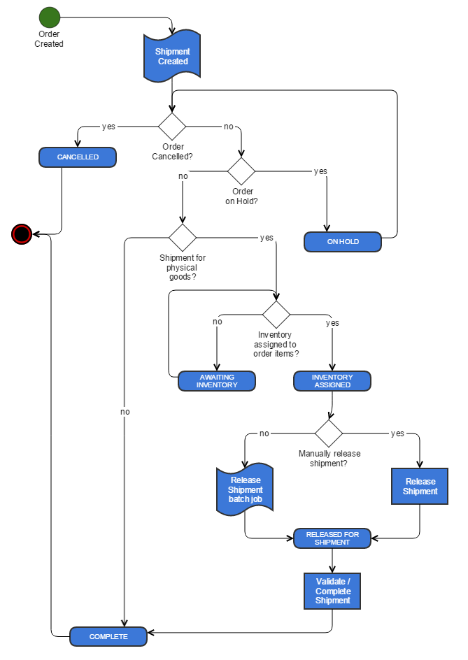

# Chapter 9: Shipping/Receiving

[TOC]

## Overview

Shipping/Receiving allows users to complete shipments. It is accessible from the tool bar:

## Shipment Workflow Process

## Importing Inventory

Authorized users can increase the stock of existing products by importing inventory data from comma-separated value (CSV) files. This is an alternative to manually updating inventory levels for multiple products, especially if you have an external system to manage your inventory and you need to be able to import a large number of inventory changes in a batch.

Before you can import inventory, you must create a warehouse import job. The import job describes the column structure of the import data files and how those columns are mapped to the data fields.

> **Note:** The CSV files may use characters other than commas to separate values if specified in Elastic Path Commerce's configuration settings.

### Creating a Warehouse Import Job

1. Create a CSV template file that describes the structure of the data you want to import.

    - This file must contain one line of comma-separated values.
    - Each value should be either the column name or a description of the data in the column.

    For example, the CSV files that you need to import are structured as follows:

    `<product sku>,<quantity on hand>,<reorder quantity>,<reorder minimum>`

    The line might look similar to the following:

    `Product SKU,Qty on Hand,Reorder Qty,Reorder Minimum`

2. On the toolbar, click the **Shipping/Receiving** button.

3. On the top right pane toolbar, click the **View Warehouse Import Jobs**  button. The **Import Jobs** tab opens.

4. Click **Create Import Job**. The _Create Import Job_ wizard appears.

5. Configure the import job settings as follows:

    | Field | Description |
    | --- | --- |
    | **Warehouse** | The warehouse whose inventory needs to be updated. |
    | **Data Type** | This must be set to _Inventory_. |
    | **Import Type** | Select one of the following options:    - **Insert &amp; Replace**: Inserts the inventory data for the product SKUs specified in the data file. If there is already inventory data for a SKU, it is overwritten with the data that is being imported.  - **Update**: Updates all the inventory data for the product SKUs specified in the data file.  - **Insert**: Inserts the inventory data for the product SKUs specified in the data file. If there is already inventory data for a SKU, the data is not imported.  - **Delete**: Deletes all the inventory data for the product SKUs specified in the data file.  - **Clear then Insert**: Clears the data for the product SKUs specified, and then inserts the inventory data for the product SKUs. |
    | **Import Name** | The name to display in the list of warehouse import jobs. |
    | **CSV Import File** | The CSV import file that was created in step 1. |
    | **Column Delimiter** | The character that separates each value in a line. All the text values must begin and end with the text delimiter character. |
    | **Text Delimiter** | The character that surrounds each text value in a line. |
    | **Max errors during import (default)** | The number of non-fatal errors that can occur before an import of this type is terminated. |

6. Click **Next**. Elastic Path Commerce verifies that the CSV file contains valid data and reports any errors. If there are any errors found, correct them, and then click **Back** to repeat this step.

7. In the _Map Data Fields_ window of the wizard, you must specify how the data in the CSV file is mapped to the inventory fields. For each data field to map, select the field in the **Data Fields** list, select the appropriate column in the **CSV Columns** list, and click **Map**.

    > **Note:** It is not necessary to map all the data fields to all the CSV columns. Only the _productSku_ field must be mapped.

8. Click **Finish**.

### Executing a Warehouse Import Job

1. On the toolbar, click the **Shipping/Receiving** button.

2. On the top right pane toolbar, click the **View Warehouse Import Jobs**  button. The **Import Jobs** tab opens.

3. Select the job that you want to run.  

4. On the top right pane toolbar, click **Run Import Job**.

5. Click the browse button next to the **CSV Import File** field, and locate the CSV file that contains the inventory data you want to import.

6. Click **Next**. Elastic Path Commerce verifies that the CSV file contains valid data and reports any errors. Verification may take a few minutes, depending on the amount of data in the file. If there are any errors found, correct them, and click **Back** to repeat this step.

7. Click **Finish**. The import may take a few minutes, depending on the amount of data in the file.

## Completing a Shipment

After the package has shipped, the shipping personnel must complete the shipment in Elastic Path Commerce. Retailers do not receive the payment for the transaction until the shipment is completed (unless the store is configured for collection of payment at the time of purchase.)

1. On the toolbar, click the **Shipping/Receiving** button.

2. On the top right pane toolbar, click the **Complete Shipment**  button. The _Complete Shipment_ dialog box appears.

3. Enter the **Shipment ID** of the order you want to complete.

4. Click **Validate**. If it is a valid shipment ID, you can complete the order.

5. Click **Complete**.

## Switching Warehouses

1. On the toolbar, click the **Shipping/Receiving** button.

2. On the top right pane toolbar, click the **Select Warehouse** button  to open the list of warehouses.  

3. Select the warehouse you want to switch to.

## Retrieving the SKU Inventory Numbers

1. On the toolbar, click the **Shipping/Receiving** button.

2. In the **Inventory** tab on the left pane, enter a SKU Code, or click the icon next to the **SKU Code** field to display a dialog box for selecting a valid SKU Code.

3. Click **Retrieve**.
