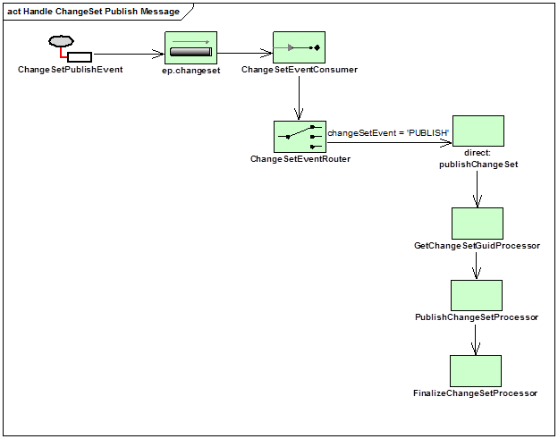

# READ ME
## Summary
The DST Message Listener is an Integration Server webapp that publishes a change set from a source to destination 
datasource. The webapp runs the Data Sync Tool for each change set and send an 
email message upon either successful or failed synchronization.

# Architecture
## Purpose
This route is responsible for handling Change Set PUBLISH JMS events by invoking the DST Client with the Change Set associated with the event.
## Prerequisites
* Data Sync project is built, and the Data Sync Tool Client is installed and configured.


### RetrieveChangeSetGuidProcessor
(labeled ```GetChangeSetGuidProcessor``` in diagram)<br>
This processor gets the GUID off the event message and stores it as an Exchange property for later processors.

### PublishChangeSetProcessor
This runs the DST Client using the Change Set GUID from the Exchange.

### ChangeSetPublishEmailProcessor
Before processing adds a new Synchronization callback class to the exchange to send an email to the originator of the request.  This will involve:
* Looking up the change set and getting the GUID of the CM User who created the change set (the createdByGuid)
* Looking up the CM User based on GUID to find the CM User's email address
* onComplete - send a successful publish notification to the CM User via Camel email component.
* onFailure - send the exception along with a user friendly message indicating change set publish failed.
* If the CM User is the **SYSTEM** user then do not send an email.

DST summary is not included in the success email as it may be very large in size. The summary can be logged to a separate file if needed.

### UpdateChangeSetStateProcessor
(labeled ```FinalizeChangeSetProcessor``` in diagram)<p>
This process updates the Change Set state to FINALIZED upon successful publish.</p>

### Error Handling
Standard retry configuration.
* Because we will be processing a single change set per event, we can use the standard retry for database connection errors.
* Anything else that fails is sent to dead letter queue.
* Emails are sent:
	* when a DST publish and change set finalize succeed,
	* when a DST publish succeeds but the change set finalize fails, or
	* when a DST publish fails.
	
# Testing Documentation

## Prerequisites
Have JMS, Search, EP Commerce servers running. Additionally, have a database with two schemas, one for source (i.e. commercedb) and one for target
 (i.e. commercedb_target). Both of them should contain the mobee test datasets.
  > NOTE: make sure to run `mvn clean install -Pupdate-db` in `extensions/database` module after adding the necessary dependencies described in the Quickstart guide.

## Testing
1. Open CM in web browser. 
2. Create a new `Change Set`.
3. Go to `Catalog Management` &rarr; Select any product from the catalog &rarr; Add that product to your newly created change set &rarr; Modify 
the product (e.g. change it's name) &rarr; Save.
4. Publish `Change Set`
    #### Through CM Client
    Navigate to `Change Set` tab &rarr; Select your change set &rarr; `Lock` and &rarr; `Publish` your change set.

	#### Through JMS
	* Find a change set GUID
	* Make sure change set state is READY_TO_PUBLISH
	* Send a JMS message like the one below to `VirtualTopic.ep.changesets` topic:
    ```json
    {"eventType":{"@class":"ChangeSetEventType","name":"CHANGE_SET_READY_FOR_PUBLISH"},"guid":"EA4BB8CC-1211-6544-B252-986DA2368A0C","data":{}}
    ```

5. Run a query on the target database using your preferred DBMS to check if the modified product was synchronized. 
